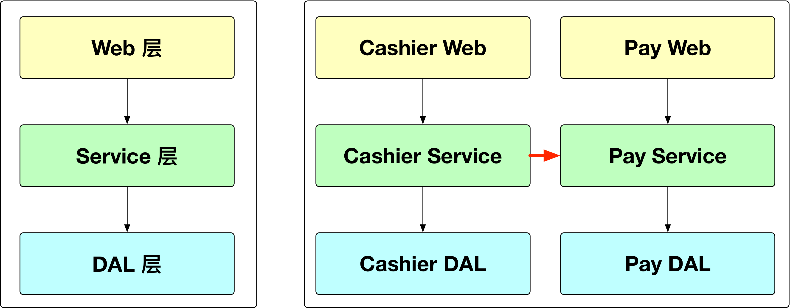
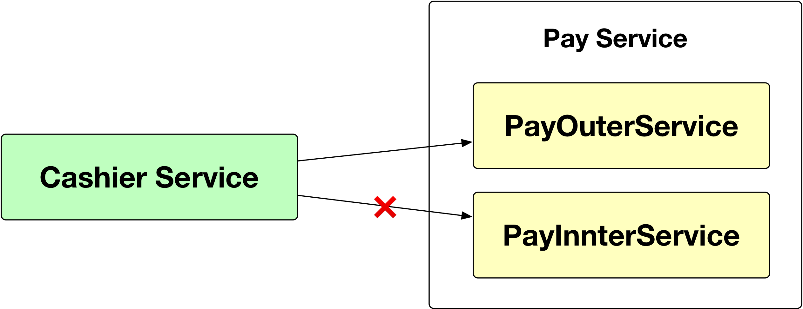
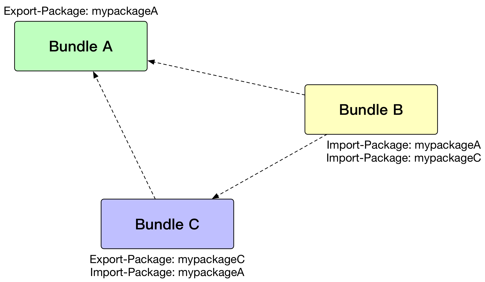

无论是什么样的业务系统，多多少少都会去做一些模块化的划分，或横或纵，各种姿势，但是这些姿势真地能帮你划分出良好的模块吗？帮你在模块之间做到高内聚，低耦合吗？模块化对于服务化又有什么样的影响？本来将分析常见的几种模块化方案的利弊，并且介绍蚂蚁金服开源的框架 SOFA 在模块化中发挥的作用。

### 传统模块化的陷阱

在一个简单的 Spring/SpringBoot 的系统中，我们常常见到一个系统中的模块会按照如下的方式进行分层，如下图中的左边部分所示，一个系统就简单地分为 Web 层、Service 层、DAL 层。



当这个系统承载的业务变多了之后，系统可能演化成上图中右边的这种方式。在上图的右边的部分中，一个系统承载了两个业务，一个是 Cashier（收银台），另一个是 Pay（支付），这两个业务可能会有一些依赖的关系，Cashier 需要调用 Pay 提供的能力去做支付。

但是在这种模块化的方案里面，Spring 的上下文依然是同一个，类也没有任何做隔离，这就意味着，Pay Service 这个模块里面的任何的一个 Bean，都可以被 Cashier Service 这个模块所依赖。极端的情况下，可能会出现下面这种情况：



Cashier Service 错误地调用了 Pay Service 中的一个内部的 Bean，造成了两个模块之间的紧耦合。

这种传统的模块化的问题在于模块化地不彻底。虽然在研发的时候，通过划分模块，把特定职责的类放到特定的模块里面去，达到了类的「物理位置」的内聚。但是在运行时，由于没有做任何隔离的手段，作为一个模块的开发者，并没有办法清楚地知道对方模块提供的对外的接口到底是什么，哪些 Bean 我是可以直接注入来用的，哪些 Bean 是你的内部的 Bean，我是不能用的。长此以往，模块和模块之间的耦合就会越来越严重，原来的模块的划分形同虚设。当系统越来越大，最后需要做服务化拆分的时候，就需要花费非常大的精力去梳理模块和模块之间的关系。

### OSGi 模块化

提到模块化，不得不提 OSGi，虽然 OSGi 没有成为 Java 官方的模块化的标准，但是由于 Java 在 Java 9 之前，一直没有官方的模块化的标准，所以 OSGi 已经是事实上的标准。

OSGi 为模块化主要做了两个事情：

1. OSGi 的类隔离
2. OSGi 的声明式服务

下面就给读者们简单地解释一下 OSGi 的这两个方面。

#### OSGi 的类隔离

OSGi 通过扩展 Java 的 ClassLoader 机制，将模块和模块之间的类完全隔离开来，当一个模块需要引用另一个模块的类的时候，通过在模块中的 MANIFEST.MF 文件中声明类的导出和导入来解决，如下图所示：



通过这种方式，可以控制一个模块特定的类才可以被另一个模块所访问，达到了一定程度地模块的隔离。

但是，光光通过类的导出导入来解决类的引用问题还不够，还需要去解决实例的引用的问题，我们往往希望能够直接使用对方模块提供的某一个类的实例，而不是自己去 new 一个实例出来，所以 OSGi 还提供了声明式服务的方式，让一个模块可以引用到另一个模块提供的服务。

#### OSGi 的声明式服务

OSGi 的声明式服务正是为了解决这个实例引用的问题，我们可以在一个 OSGi 的模块（Bundle）中去添加一个 XML 配置文件去声明一个服务，如下面的代码所示：

```xml
<?xml version="1.0" encoding="UTF-8"?>
<scr:component xmlns:scr="http://www.osgi.org/xmlns/scr/v1.1.0" name="ITodoService">
   <implementation class="com.example.e4.rcp.todo.service.internal.MyTodoServiceImpl"/>
   <service>
      <provide interface="com.example.e4.rcp.todo.model.ITodoService"/>
   </service>
</scr:component>
```

也可以同样的通过 XML 配置文件去引用一个其他的模块声明的服务：

```xml
<?xml version="1.0" encoding="UTF-8"?>
<scr:component xmlns:scr="http://www.osgi.org/xmlns/scr/v1.1.0" name="XXXService">
    <reference name="ITodoService"
            interface="com.example.e4.rcp.todo.model.ITodoService"
            bind="setITodoService" cardinality="0..1" unbind="unsetITodoService"
            policy="dynamic" />
   <implementation class="com.example.e4.rcp.todo.service.internal.XXXServiceImpl"/>
</scr:component>
```

通过声明式服务的方式，我们就可以直接在一个 OSGi 的 Bundle 中使用另一个 Bundle 中提供的服务实例了。

#### OSGi 的模块化的问题

OSGi 通过类隔离的机制解决了模块之间的类隔离的问题，然后通过声明式服务的方式解决了模块之间的服务调用的问题，看起来已经完美的解决了我们在传统的模块化中遇到的问题，通过这两个机制，模块和模块之间的边界变得清晰了起来。

但是在实践的过程中，OSGi 的模块化却面临着一个非常严峻的问题，这个就是就是 OSGi 的类隔离带来的复杂性，OSGi 把每一个模块都通过独立的 ClassLoader 去加载，这样在开发模块的时候，研发的同学就必须非常清楚地去定义哪些类应该导出，哪些类应该导入，一旦少导出，或者导出错误，就会出现各种各样的错误，比如 LinkageError，NoSuchMethodError 等等，而要解决这些错误，要求研发同学清楚地理解 OSGi 的整个类加载体系，以及 Java 的整个类加载体系，这对普通的研发同学来说实在是一个太高的要求。所以这种方式在实施成本非常高，OSGi 并不是非常适合于业务研发。

### SOFA 模块化

为了解决传统的模块化方案模块化不彻底的问题，以及 OSGi 的彻底的模块化带来的复杂性的问题，SOFA 在早期就开始引入了一种折衷的模块化的方案。

SOFA 模块化的整体的示意图如下：


SOFA 模块化的方案，给每一个模块都提供了一个单独的 Spring 的上下文，通过 Spring 上下文的隔离，让模块和模块之间的 Bean 的引用无法直接进行，达到模块在运行时隔离的能力。当一个模块需要调用另一个模块里面的一个 Bean 的时候，SOFA 采用了类似于 OSGi 的声明式的服务的方式，提供服务的模块可以在其配置文件（也可以通过 Annotation 的方式来声明）中声明一个 SOFA Service：

```xml
<sofa:service ref="sampleBean" interface="com.alipay.sofaboot.SampleBean"/>
```

使用服务的模块可以在其配置文件（也可以通过 Annotation 来使用）声明一个 SOFA Reference：

```xml
<sofa:reference id="sampleBean" interface="com.alipay.sofaboot.SampleBean"/>
```

通过这种方式，一个模块就可以清晰地知道它提供了哪些服务，引用了哪些服务，和其他的模块之间的关系也就非常清楚了。

但是 SOFA 的模块化方案中并没有引入类隔离的方案，这也是为了避免研发的同学去处理太复杂的类加载的问题，简化研发的成本。

### 通过 SOFA 模块化做快速地服务化

上面已经讲到，通过 SOFA 的模块化的方案，我们就可以非常清楚地知道一个模块的边界在哪里，它依赖了哪些服务，它又发布了哪些服务。当你的应用膨胀到需要去做服务化的时候，这样，拆分起来就非常简单了。

而 SOFA 在这个上面其实做了一件更加方便大家做服务拆分的事情，就是 SOFA 的模块之间的服务发布和服务引用和 SOFA 的应用之间的服务的发布和引用的编程模型以及接口是一致的。


如上图所示，当原来包含了 Cashier 和 Pay 两个能力的系统需要拆分成两个系统的时候，只需要在原来声明 SOFA Service 和 SOFA Reference 的地方，加上一个协议的声明就行，比如，原来发布的服务是下面这样：

```xml
<sofa:service ref="sampleBean" interface="com.alipay.sofaboot.SampleBean"/>
```

只需要修改成：

```xml
<sofa:service ref="sampleBean" interface="com.alipay.sofaboot.SampleBean">
    <sofa:binding.bolt/>
</sofa:service>
```

原来引用服务是下面这样：

```xml
<sofa:reference id="sampleBean" interface="com.alipay.sofaboot.SampleBean"/>
```

只需要修改成：

```xml
<sofa:reference id="sampleBean" interface="com.alipay.sofaboot.SampleBean">
    <sofa:binding.bolt/>
</sofa:reference>
```

事实上，这种快速的服务化拆分的方式，也在蚂蚁金服整个架构往服务化转型的过程中提供了极大的便利。

### 总结

本文主要分析了传统的模块化以及 OSGi 的模块化的方案的在实践中的缺点，然后介绍了 SOFA 的模块化的方案，并且介绍了 SOFA 的模块化的方案在服务化过程中可以带来的好处。

---

* 本文基于作者在饿了么北京开源技术沙龙的分享的部分内容所整理，现场分享的 PPT 以及视频，可以从 <https://www.itdks.com/eventlist/detail/2341> 观看。
* 关于 SOFA 模块化的详细的文档以及 Demo，可以参考：<http://www.sofastack.tech/sofa-boot/docs/Modular-Development>
* SOFA 模块化的能力的源代码在 <https://github.com/alipay/sofa-boot> 下面的 `isle-sofa-boot-starter` 目录下面。
* 目前蚂蚁将近 2000 个 SOFA 的系统都是采用了上面的模块化的方案进行模块的划分。