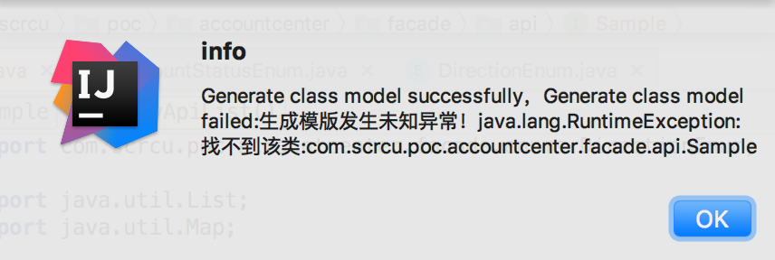

# 常见问题

## Q：报错误NoSuchMethodError

一般情况下该类错误由依赖冲突导致。已知普遍导致冲突的jar列举如下，遇到时选择性排除它们。

### 日志冲突
#### commons-logging冲突
```
<exclusion>
    <artifactId>commons-logging</artifactId>
    <groupId>commons-logging</groupId>
</exclusion>
```

#### logback冲突
其中spring-boot-starter-logging和spring-test为应用依赖的对应版本
```
<dependency>
    <groupId>org.springframework.boot</groupId>
    <artifactId>spring-boot-starter-logging</artifactId>
    <version>1.4.2.RELEASE</version>
    <exclusions>
        <exclusion>
            <groupId>ch.qos.logback</groupId>
            <artifactId>logback-classic</artifactId>
        </exclusion>
    </exclusions>
</dependency>
<dependency>
    <groupId>org.springframework</groupId>
    <artifactId>spring-test</artifactId>
    <version>4.3.4.RELEASE</version>
    <exclusions>
        <exclusion>
            <groupId>ch.qos.logback</groupId>
            <artifactId>logback-classic</artifactId>
        </exclusion>
    </exclusions>
</dependency>
```

### yaml冲突

```
java.lang.NoSuchMethodError: org.yaml.snakeyaml.Yaml.<init>(Lorg/yaml/snakeyaml/constructor/BaseConstructor;)V
```

spring-boot-starter-test里引用的yaml和org.testng里面引用的yaml冲突。

这里以排除spring-boot-starter-test中的yaml为例（也可选择在testng等其他位置排除冲突）
```
<dependency>
    <groupId>org.springframework.boot</groupId>
    <artifactId>spring-boot-starter-test</artifactId>
    <scope>test</scope>
    <exclusions>
        <exclusion>
            <groupId>org.yaml</groupId>
            <artifactId>snakeyaml</artifactId>
        </exclusion>
    </exclusions>
</dependency>
```

## Q：报错NoClassDefFoundError

一般情况下依赖缺失或者依赖冲突会导致该类问题。

### mockito报错找不到类

sofaboot使用mockito时，spring-boot-starter-test里包含了mockito，无需重复依赖。

## Q：报错no bean dataAccessConfigManager

在ACTS测试脚本指定的Application启动类中，却少缺少acts-core.xml，如图添加即可。


<div data-type="alignment" data-value="center" style="text-align:center">
  <div data-type="p">图1</div>
</div>


## Q：No runnable methods

一般是选择Junit运行ACTS测试脚本，ACTS用例需要使用testng运行。

## Q：生成模版异常
有较多情况会导致这一现象，较为常见的是，新编写的类或者对类进行变更后，没有进行mvn编译。
先执行mvn clean install -Dmaven.test.skip=true，再进行模版生成。


<div data-type="alignment" data-value="center" style="text-align:center">
  <div data-type="p">图2</div>
</div>

## Q：编辑器设置入参错误
使用acts编辑器操作入参时，出现无法选中或者设置数值出错等情况，一般是生成测试脚本操作有误，没有生成入参模版而直接生成测试脚本，导致初始生成的yaml中入参数据不正确。

解法一：通过编辑器删除该节点，然后右键入参设置-->模版选择，给入参一个正确的模版值。
解法二：删除测试脚本对应的yaml文件，然后打开acts编辑器，右键入参设置-->模版选择，给入参一个正确的模版值，yaml会自动重建。
解法三：删除生成的测试脚本和yaml文件，生成入参模版，重新生成测试脚本，yaml中会默认带入参设置；

## Q：argument type mismatch
该问题一般是被测方法有多个同名重载方法，导致参数不匹配报错。


<div data-type="alignment" data-value="center" style="text-align:center">
  <div data-type="p">图3</div>
</div>

+ 解决方法

可以在脚本中重写基类的findMethod 方法，返回真正要测的对象。下面的方法也适用于获取被测方法失败的情况。 

```
@Override
    public void beforeActsTest(ActsRuntimeContext actsRuntimeContext) {

        Method method =null;
        try {
            method = VirtualAssetQueryService.class.getDeclaredMethod ("query", QueryVirtualAssetListParam.class);
        } catch (NoSuchMethodException e) {
            e.printStackTrace();
        } catch (SecurityException e) {
            e.printStackTrace();
        }
        actsRuntimeContext.setTestedMethod(method);
    }
```


<div data-type="alignment" data-value="center" style="text-align:center">
  <div data-type="p">图4</div>
</div>
