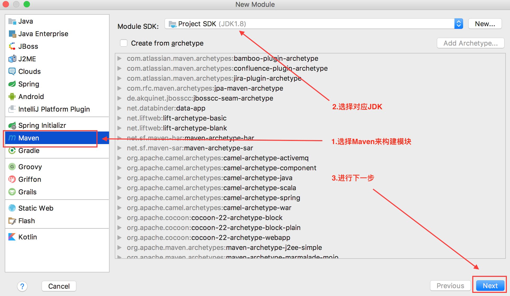
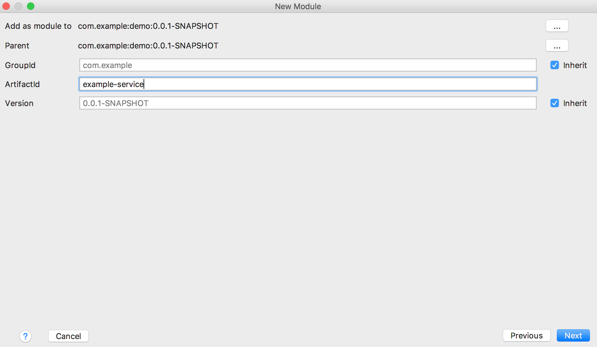
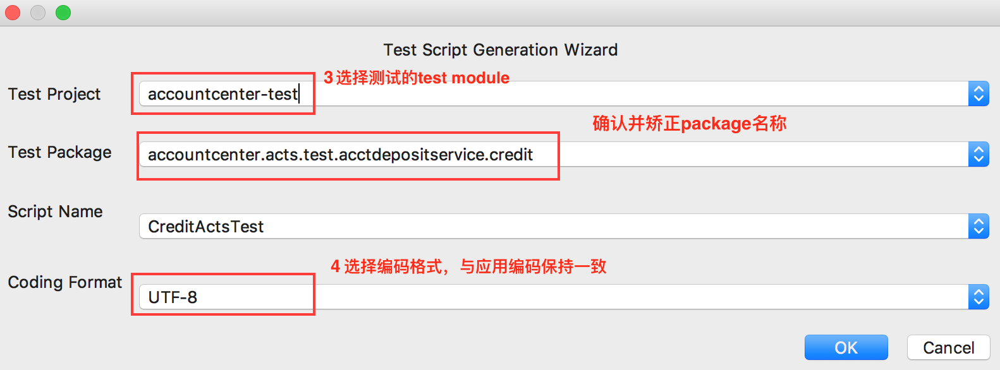

# 快速开始

本文档共分为四部分：

第一部分：指引你如何在 Intellij IDEA 上安装 ACTS IDE ；

第二部分：向你介绍如何在多模块工程中引入 ACTS 依赖；

第三部分：test 模块下一键搭建 ACTS 框架管理后续 ACTS 用例；

第四部分：一键生成 ACTS 测试脚本；

## 1.安装 ACTS IDE

__推荐 Intellij IDEA 2017 版本__。本地磁盘安装：Preference -> Plugins -> Install plugin from disk -> Restart Idea 。

__为了您的安全，请仅从该下载源获取 ACTS IDE 安装包：__[点击下载 ACTS IDE](https://gw.alipayobjects.com/os/basement_prod/c09f3a6a-b49a-4ab9-a56e-4994e033ae7b.zip)。


<div data-type="alignment" data-value="center" style="text-align:center">
  <div data-type="p">图1.1</div>
</div>

## 2.引入 ACTS 依赖
在引入 ACTS 依赖之前，需要你的应用是一个多模块工程（包含 test 模块），后续 ACTS 会将全部的测试代码放置在 test 模块，便于管理测试用例。
你可以依据应用的具体情况，选择性的阅读以下内容：

应用已经是完整的多模块工程，可参考[文档2.1部分](#21多模块应用-包含test模块)，帮助你引入 ACTS 依赖；

应用是多模块工程但无test模块，可参考[文档2.2部分](#22多模块应用-无test模块)，帮助你快速添加 test 模块；

应用不是一个多模块工程，可参考[文档2.3部分](#23非多模块应用)，帮助你快速构建多模块工程。

如果还没有创建工程，可参考 [SOFABoot快速开始](http://www.sofastack.tech/sofa-boot/docs/QuickStart) 搭建应用。

### 2.1多模块应用-包含 test 模块

只需在 test 模块的 pom.xml 中引入 acts-bom 即可。
```xml
<dependency>
    <groupId>com.alipay.sofa.acts</groupId>
    <artifactId>acts-bom</artifactId>
    <version>${acts.version}</version>
    <type>pom</type>
</dependency>
```


### 2.2多模块应用-无 test 模块

这里是使用 Intellij IDEA 来创建子模块。

对着父工程右键 -> New -> Module -> 输入 test 模块名字（一般是 appname-test），分步示例图如下：

#### 第一步：新建 test 模块


<div data-type="alignment" data-value="center" style="text-align:center">
  <div data-type="p">图2.1</div>
</div>



<div data-type="alignment" data-value="center" style="text-align:center">
  <div data-type="p">图2.2</div>
</div>


<div data-type="alignment" data-value="center" style="text-align:center">
  <div data-type="p">图2.3</div>
</div>


<div data-type="alignment" data-value="center" style="text-align:center">
  <div data-type="p">图2.4</div>
</div>

#### 第二步：管理 test 模块
在父工程的 pom.xml 中管理刚刚新建的 test 模块。


<div data-type="alignment" data-value="center" style="text-align:center">
  <div data-type="p">图2.5</div>
</div>


#### 第三步：依赖 ACTS 引入
最后，找到刚刚新建的 test 模块，并在其 pom.xml 中引入 acts-bom 即可。
```xml
<!-- 引入包含 SOFABootApplication 的 pom -->
<dependency>
    <groupId>com.example</groupId>
    <artifactId>example-service</artifactId>
</dependency>

<!-- 引入 ACTS 依赖 -->
<dependency>
    <groupId>com.alipay.sofa.acts</groupId>
    <artifactId>acts-bom</artifactId>
    <version>${acts.version}</version>
    <type>pom</type>
</dependency>
```

### 2.3非多模块应用
如果你已经有了一个不错的 SOFABoot 应用，但它不是一个多模块应用，下面的内容将帮助你快速地将现有工程构建为多模块工程。

#### 第一步：新建父工程
创建好一个 SOFABoot 工程，然后删除无关的文件，只需保留 pom.xml 文件。


<div data-type="alignment" data-value="center" style="text-align:center">
  <div data-type="p">图2.6</div>
</div>

#### 第二步：新建子模块

新建子工程模块，将原有应用作为子工程并入父工程下，相关依赖管理提到父工程中。以新建 service 模块和 test 模块为例。


<div data-type="alignment" data-value="center" style="text-align:center">
  <div data-type="p">图2.7</div>
</div>


<div data-type="alignment" data-value="center" style="text-align:center">
  <div data-type="p">图2.8</div>
</div>


<div data-type="alignment" data-value="center" style="text-align:center">
  <div data-type="p">图2.9</div>
</div>

#### 第三步：管理子模块


<div data-type="alignment" data-value="center" style="text-align:center">
  <div data-type="p">图2.10</div>
</div>

#### 第四步：依赖引入
最后，在 test 模块的 pom.xml 文件中引入 acts-bom 即可。
```xml
<dependency>
    <groupId>com.alipay.sofa.acts</groupId>
    <artifactId>acts-bom</artifactId>
    <version>${acts.version}</version>
    <type>pom</type>
</dependency>
```

## 3.一键初始化 ACTS 测试框架
下面只需要你轻轻动动手指即可完成初始化工作。在图3.2中，你需要正确填写应用名称并选择适合应用的编码格式。
有关一键初始化做了什么，生成的文件有何作用，可以参考 ACTS 使用手册的[框架准备](./Usage-Ready.md#一键配置的说明)部分。


<div data-type="alignment" data-value="center" style="text-align:center">
  <div data-type="p">图3.1</div>
</div>


<div data-type="alignment" data-value="center" style="text-align:center">
  <div data-type="p">图3.2</div>
</div>

## 4.一键生成测试脚本

### 4.1启动类
将 service 模块中的启动类，如 SOFABootApplication 拷贝到 test 模块，并增加需要加载的配置文件：`classpath*:META-INF/spring/acts-core.xml`


<div data-type="alignment" data-value="center" style="text-align:center">
  <div data-type="p">图4.1</div>
</div>

### 4.2测试脚本

前提条件：__务必 mvn 编译工程和生成对象模型，否则会造成 ACTS IDE 不可预料的错误，如无法编辑、数据不正确等。__

接口定义的方法上点击，选择 ACTS 功能 -> 生成测试用例。


<div data-type="alignment" data-value="center" style="text-align:center">
  <div data-type="p">图4.2</div>
</div>



<div data-type="alignment" data-value="center" style="text-align:center">
  <div data-type="p">图4.3</div>
</div>


<div data-type="alignment" data-value="center" style="text-align:center">
  <div data-type="p">图4.4</div>
</div>
