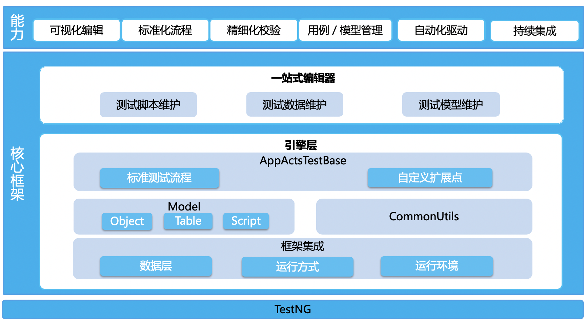
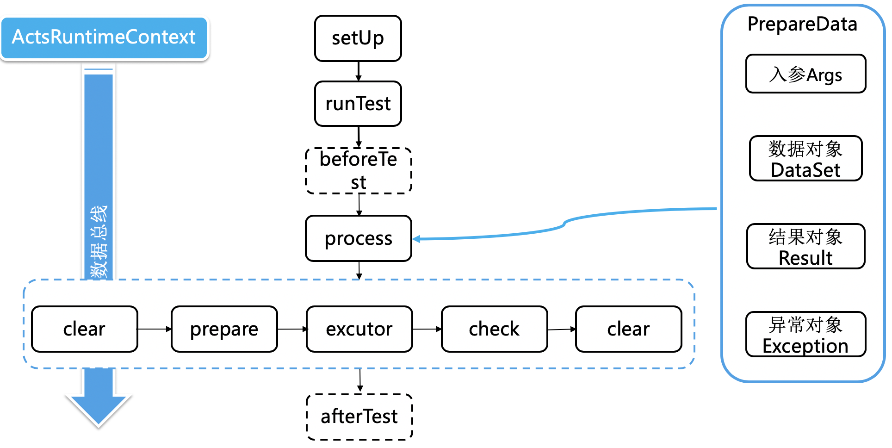

# SOFAStack页面-产品介绍

[参考sofarpc](http://www.sofastack.tech/sofa-rpc/docs/Home)
## 产品描述
ACTS（AntCoreTest）源于蚂蚁金服多年金融级分布式架构工程的测试实践积累与沉淀，为企业提供高效、精细化的接口自动化测试。
与现有的诸如TestNG等开源框架相比，ACTS除了具备通用的数据自动化驱动等测试能力之外，还具有契合快速的互联网发展、复杂的分布式金融系统特点的模型驱动、可视化编辑、标准流程引擎等新特性，可辅助工程师高效、高质量地完成系统测试用例编写维护以及标准化精准化的测试验证。

ACTS是基于数据模型驱动测试引擎执行的的新一代测试框架（如图1），适配TestNg＋Spring的测试上下文环境，它的数据以yaml为载体，在此上构建数据模型驱动，实现了精细化结果校验、可视化编辑、高效化用例管理等，可以极大压缩测试代码体积。

图1

## 运行原理

图2

1. 测试用例启动的时候,ActsDataProvider首先会启动被测方法(被 @Test 注解的方法),加载对应的yaml数据文件(测试数据以yaml形式承载),然后转换成对应的PrepareData对象；
2. runTest方法开始执行时，prepareData和用例名称会用来作为当前这次测试的入参,传递给runTest方法,根据这些信息组装出ActsRuntimeContext上下文,在整个过程中传递,同时用这个上下文初始化TestUnitHandler测试处理器，然后runTest->process方法期间执行以下四个子流程：

| 说明 | 方法 |
| :--- | :--- |
| 清理 | clear(actsRuntimeContext); |
| 准备 | prepare(actsRuntimeContext); |
| 执行 | execute(actsRuntimeContext); |
| 检查 | check(actsRuntimeContext); |

方法功能说明：
清理阶段：清理准备数据、校验数据，防止脏数据对测试脚本产生影响；
准备阶段：准备DB数据；
执行阶段：调用被测方法；
检查阶段：根据测试数据，校验返回结果、DB数据和异常信息等内容。

## 功能描述
ACTS提供了以下的能力：
### 2.1 数据可视化编辑
框架实现了测试数据与测试代码的分离，同时配套提供可视化编辑器ACTS IDE，通过ACTS IDE可以快速地录入、查看和管理用例数据，有效减少重复性的数据准备代码。
### 2.2 精细化校验
为了提高返回结果、DB数据等期望数据的填写效率和减少检验点遗漏，框架提供了预跑返填功能;在ACTS校验规则标签的标记下，实现期望DB数据、期望结果等数据的精细化校验。
### 2.3 灵活可扩展
ACTS提供了了丰富的API，其封装于ActsRuntimeContext类中，借助API可快速获取和设置自定义参数、用例入参、期望结果等，满足用户对用例数据的自定义操作；
### 2.4 自定义引擎各阶段
为了提高ACTS的灵活可扩展性，框架的ActsTestBase测试基类对外暴露各个执行阶段方法，包括prepare，execute，check，clear等，例如在测试类中通过重写process方法可将整个测试脚本重新编排。
### 2.5 统一配置能力
配置文件中提供丰富的配置能力以定制化框架的个性需求。

## 应用场景
基于SOFABoot搭建的应用，在Idea开发环境下快速编写和执行接口测试脚本。推荐使用Idea 2017版_以便能更好地兼容ACTS IDE编辑器。