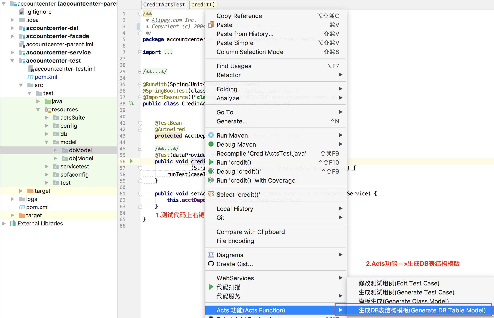
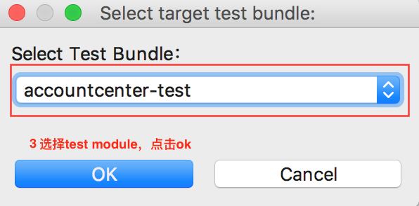
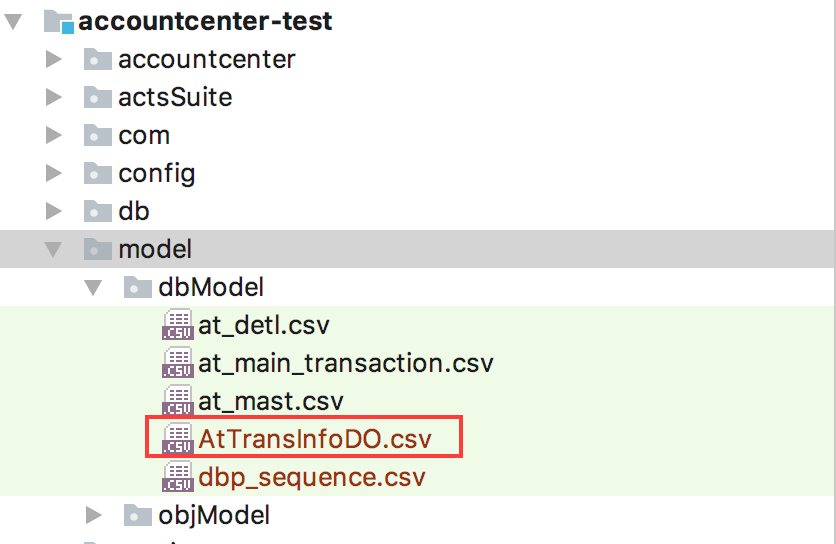
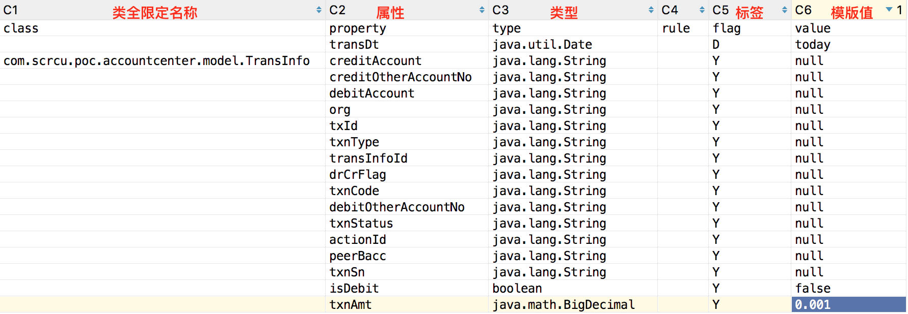
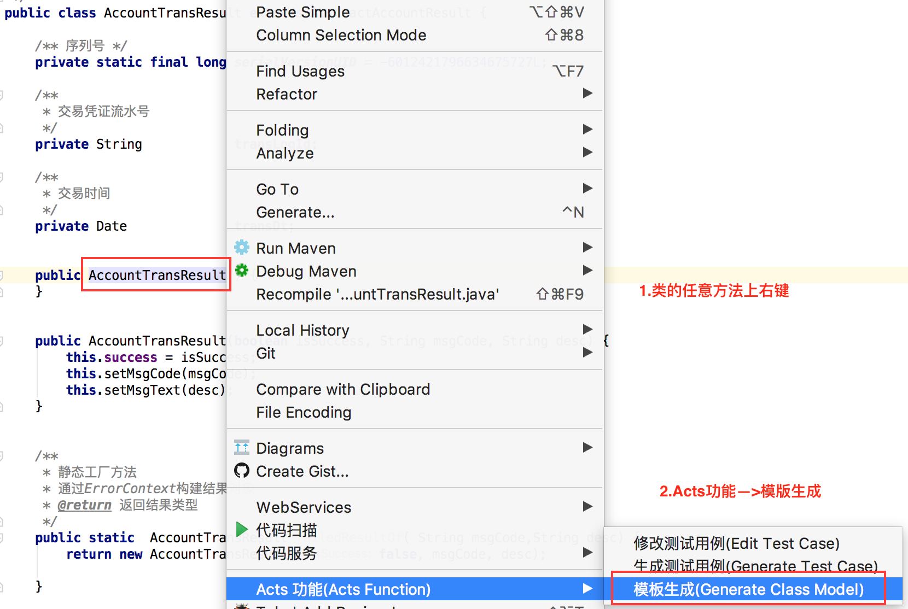
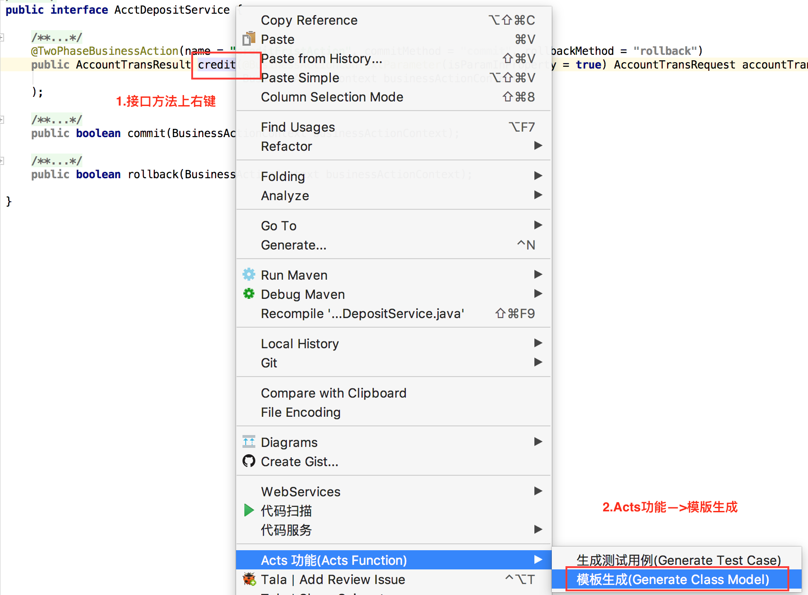

# 一键模型化

## 快速理解ACTS中模型
在写测试用例的过程中，需要预先准备一些DB表、方法入参的数据，或者需要校验一些DB表、返回结果的数据，这些数据可以以模版的形式保存下来，在编辑用例时，可以方便的导入这些数据到准备数据或者校验数据，实现数据复用。目前，ACTS模型可以分为DB模型和类模型。

常规的测试用例编写，DB、方法入参、返回结果等领域模型的数据准备是通过测试代码组织的，随着业务复杂度，领域模型复杂度也在不断增加，尤其在金融级业务用，往往一个类或者数据表有数十个属性或者字段，类与类的嵌套也是随处可见，代码构造复杂对象变得十分困难且容易疏漏，问题频现：
* 表太多容易遗漏，排除时间太长；
* 表的字段名记不住，时不时写错；
* 接口入参数量多类型复杂，看见就头疼；
* 类的属性太多，容易遗漏重要属性；
* 嵌套构造对象，不断的new和set赋值；
* 继承和实现关系复杂，遗漏重要属性；

ACTS的模版有可以有效应对上述问题，通过将类和表固化为cvs，类的结构一目了然，通过类、数据表的模版可以快速的模版化地创建对象，并序列化到yaml文件中，使用ACTS IDE可以方便的管理用例数据。

### 模型存储位置

在test模块的resource/model目录可以查看已经存在的模型。

<div data-type="alignment" data-value="center" style="text-align:center">
  <div data-type="p">图4</div>
</div>

## 数据表模型生成

### 数据表模型样例


<div data-type="alignment" data-value="center" style="text-align:center">
  <div data-type="p">图5</div>
</div>

1. flag说明
    ```
    Y: 插入
    N：不插入
    C：以此为where条件对插入后的数据进行清理
    F：数据库函数
    L: 大字段换行准备，准备方式为A=B;C=D
    ```
2. 用例编辑使用模型快速导入数据

使用ACTS IDE编辑DB表数据（包括准备表数据、期望表数据）时，可右键新增指定表的模型，用于直接从表模型的csv中导入表的全部字段和值，以便快速编辑。DB模版的使用可参考 准备期望DB数据。

### 生成表模型

#### idea版插件生成表模型


<div data-type="alignment" data-value="center" style="text-align:center">
  <div data-type="p">图6</div>
</div>



<div data-type="alignment" data-value="center" style="text-align:center">
  <div data-type="alignment" data-value="center" style="text-align:center">
    <div data-type="p">图7</div>
  </div>
</div>


<div data-type="alignment" data-value="center" style="text-align:center">
  <div data-type="alignment" data-value="center" style="text-align:center">
    <div data-type="p">图8</div>
  </div>
</div>

点击OK后生成模板如下：


<div data-type="alignment" data-value="center" style="text-align:center">
  <div data-type="alignment" data-value="center" style="text-align:center">
    <div data-type="p">图9</div>
  </div>
</div>


idea版同时支持不配置直连获取表结构的方式生成表模型，即在DO类上右键根据DO生成表模型：
DO类上右击-->ACTS功能-->生成DO模型：


<div data-type="alignment" data-value="center" style="text-align:center">
  <div data-type="p">图10</div>
</div>



<div data-type="alignment" data-value="center" style="text-align:center">
  <div data-type="p">图11</div>
</div>

## 对象模型生成

### 对象模型样例


<div data-type="alignment" data-value="center" style="text-align:center">
  <div data-type="p">图12</div>
</div>


<div data-type="alignment" data-value="center" style="text-align:center">
  <div data-type="p">图13</div>
</div>

一个复杂对象是一个闭包，里面不但包含其自身模型，还包含其嵌套对象的模型。

（1）用例编辑使用模型快速导入数据：插件编辑复杂对象时（包括入参、返回结果、mock返回结果、消息DTO等）时，可右键新增指定的复杂对象模型，用于直接从复杂对象模型构建该类型对象并赋值，以便快速编辑。

（2）原子数据规则的构建：在使用一键生成用例功能时，需要配置原子数据规则并构建到数据库，复杂对象模型中的rule列就是用来自定义规则的地方，构建时将每一个复杂对象模型中rule列自定义的规则插入数据库，以便生成用例时从自定义的规则中取值。

### 生成方法
有两种方式：1.待构建模型的类定义的任意方法上点击；2.接口定义的方法上点击。详细操作看下图示例。

使用IDEA的同学请注意：请先确保代码已编译，IDEA不会自动编译，手动mvn clean install或者打开自动编译，File->Settings->Build,Execution,Deployment->Compiler->Make project automatically。
#### idea版插件生成对象模型
（1）待构建模型的类定义的任意方法上点击，生成当前类的模型。


<div data-type="alignment" data-value="center" style="text-align:center">
  <div data-type="p">图14</div>
</div>

（2）接口定义任意方法上点击，生成当前接口中，所有方法的复杂入参、复杂返回结果的模型。


<div data-type="alignment" data-value="center" style="text-align:center">
  <div data-type="p">图15</div>
</div>
