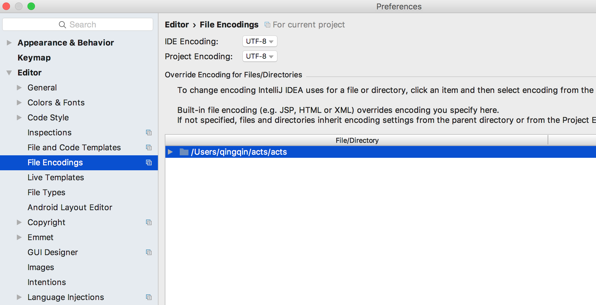

# 框架准备

## 编码说明

请确保ACTS的编码与系统代码的编码一致，即确定以下的编码保持一致：生成脚本选择的编码、workspace的编码应该都与应用代码编码保持一致。不一致会出现乱码问题。
生成脚本选择的编码，如下图设置：


<div data-type="alignment" data-value="center" style="text-align:center">
  <div data-type="p">图1</div>
</div>

IDEA workspace的编码


<div data-type="alignment" data-value="center" style="text-align:center">
  <div data-type="p">图2</div>
</div>

## 数据源配置

ACTS配置数据源的目的，是为了在数据准备、数据清理、数据校验阶段，能够使用系统的数据源正确的进行DB增删改查。
* 1.数据源配置 

    在src/test/resource/config/acts-config.properties中，配置dal层的bundleName、数据源以及表的对应关系，以ds_开头，如下：
    ```
    datasource_bundle_name =com.alipay.testapp.common.dal
    ds_数据源bean1=逻辑表名1,逻辑表名2
    ds_数据源bean2=逻辑表名3,逻辑表名4
    ```
    其中数据源bean1、数据源bean2是应用代码中dal层的数据源bean的名称，支持多个数据源,后面的表名支持正则表达式，不需要带分库分表后缀，若有多个数据源，请注意配置的时候，某张表只能属于一个数据源，如下图：


<div data-type="alignment" data-value="center" style="text-align:center">
    <div data-type="p">图3</div>
</div>

* 2. 数据库直连
    数据库直连，用于DB数据模型的生成。在src/test/resource/config/dbConf/下的devdb.conf或testdb.conf中配置如下：
    ```
    xxx_url = jdbc:oracle:thin:@localhost:1521:cifdb
    xxx_username = myname
    xxx_password = mypswd
    ```
