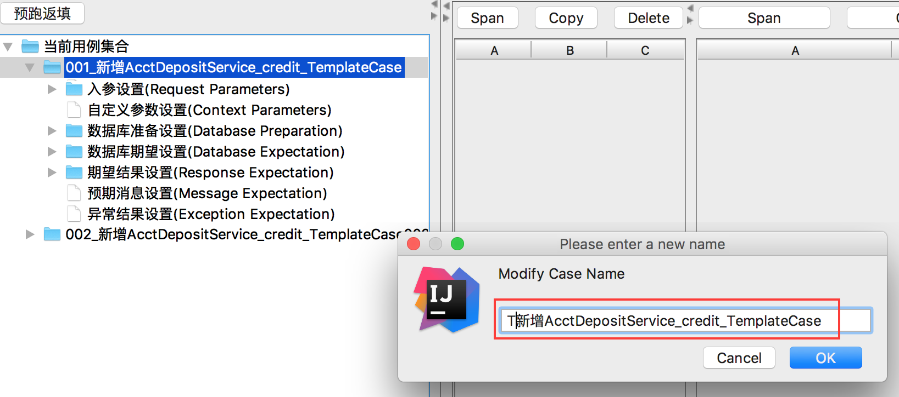

# 一键脚本化
## 快速理解ACTs中的脚本
如果你是一个经常编写测试用例的同学，是不是经常苦于这样的问题：
* 自嘲成为一个精通if else get set的ctrl cv搬运工；
* 不断的assertEquals写得快吐了，重复性编码毫无创意；
* 少一个assert容易假绿，错一个败坏心情；
* 场景一旦复杂，测试代码比业务代码还要长，写起来痛不欲生；
* 每换一个应用，之前写的工具类就要搬一次；

左图为TestNG用例，右图为ACTs用例，重复性代码一去不回，代码体积明显缩小。区别于普通测试脚本，ACTs脚本继承自ActsTestBase类，封装了数据加载、驱动、执行引擎和校验规则，无需用户来组织清理数据、准备数据、执行用例和校验结果，对于简单业务可以做到零编码，极大释放代码编写和后期维护成本。


<div data-type="alignment" data-value="center" style="text-align:center">
  <div data-type="p">图16</div>
</div>

## 测试脚本生成

前提条件：__务必事先生成对象模型，即方法的入参、返回结果等模型生成，否则会造成acts视图编辑器不可预料的错误，如无法编辑、编辑数据不正确等。__

接口定义的方法上点击，选择Acts功能-->生成测试用例。


<div data-type="alignment" data-value="center" style="text-align:center">
  <div data-type="p">图17</div>
</div>


<div data-type="alignment" data-value="center" style="text-align:center">
  <div data-type="p">图18</div>
</div>


<div data-type="alignment" data-value="center" style="text-align:center">
  <div data-type="p">图19</div>
</div>

## 测试脚本运行
  方法：右键acts脚本中的被测方法，选择testng来执行测试脚本，如下图：


<div data-type="alignment" data-value="center" style="text-align:center">
  <div data-type="p">图20</div>
</div>

## 指定测试脚本运行

在src/test/resource/config/acts-config.properties中，配置test\_only属性，可以写一个正则表达式匹配需要运行的脚本描述。
1、 在src/test/resource/config/acts-config.properties中，配置test_only＝^T，表示只跑用例名称以T开头的用例，^T也可以换成其他正则表达式。
```
#指定执行用例描述以T开头的用例
test_only=^T
```

2、修改要跑的用例名称，双击用例名称，编辑用例用例名前面加T，就可以在run时仅跑用例名称以T开头的用例，可以编辑符合test\_only正则表达式的内容。


<div data-type="alignment" data-value="center" style="text-align:center">
  <div data-type="p">图21</div>
</div>



<div data-type="alignment" data-value="center" style="text-align:center">
  <div data-type="p">图22</div>
</div>


<div data-type="alignment" data-value="center" style="text-align:center">
  <div data-type="p">图23</div>
</div>


## 脚本用例拆分功能

默认每个测试脚本的所有用例数据保存在同一个yaml中，ACTs支持用例数据根据开关spilt_yaml_by_case来决定同一测试脚本的所有用例数据存储在一个yaml中还是每个case存储为一个yaml。开关默认为关闭，即同一测试脚本的所有测试数据存储在一个yaml中，开关打开方法：在acts-config.properties中配置:

```
spilt_yaml_by_case=true
```

开关打开后，新生成的测试脚本的数据存储方式就是一个case一个yaml，yaml的名称为caseId，拆分的方式可以降低多人研发同一接口带来的文件冲突问题。 此外，为了支持将老的yaml文件按用例拆分，acts提供了工具类，如下，支持将指定脚本下，指定路径的yaml文件按用例拆分。

   __BaseDataUtil.saveYamlDataToCaseByCase__

* 注意：拆分后，建议先给原有yaml重命名做备份，然后打开用例编辑器检查拆分后的文件内容是否正确，确认无误后可删除原有yaml文件。一般单个yaml文件和拆分后的yaml文件不能并存。

## 编码方式准备数据
ACTs提供了数据自定义api接口，封装于ActsRuntimeContext类中，如下：
(1)快速获取和设置自定义参数
获取全部自定义参数：getParamMap getParamMap()
按key获取：Object getParamByName(String paraName)
新增自定义参数：void addOneParam(String paraName, Object paraObj)
替换自定义参数：void setParamMap(Map<String, Object> paramMap)
泛型方式获取自定义参数，避免强转：T getParamByNameWithGeneric(String paraName)

(2)快速获取和设置用例入参
获取所有入参：List getInputParams() 
按位置获取：Object getInputParamByPos(int i)
新增用例参数：void addInputParam(Object obj) 

(3)快速获取和设置期望结果
获取期望结果：Object getExpectResult() 
设置期望结果：Boolean setExpectResult(Object objToSet)

## Mock功能使用
mock功能目前是采用Mockito的方案，如下配置使用；具体资料见（[Mockito英文文档](https://static.javadoc.io/org.mockito/mockito-core/2.18.3/org/mockito/Mockito.html)和[Mockito中文文档](https://github.com/hehonghui/mockito-doc-zh)
### 增加依赖
```
<dependency>
    <groupId>org.springframework.boot</groupId>
    <artifactId>spring-boot-starter-test</artifactId>
    <scope>test</scope>
</dependency>
```
默认spring test 依赖的mockito版本是1.x，想要升级的可以再引入相应的版本
```
<dependency>
    <groupId>org.mockito</groupId>
    <artifactId>mockito-core</artifactId>
    <version>2.18.3</version>
</dependency>
```

__Mockito__ 用于测试时进行打桩处理，通过它可以指定某个类的某个方法在什么情况下返回什么样的值。Mockito库能够Mock对象、验证结果以及打桩(stubbing)，如下：

__demo1__
```
@SpringBootTest(classes = SOFABootApplication.class)
@TestExecutionListeners(listeners = MockitoTestExecutionListener.class)
public class RegisterUserActsTest extends ActsTestBase {

    @TestBean
    @Autowired
    // 这是测试类
    public UserService userService;

    @MockBean
    // 这是要mock的bean
    public AccountManageFacadeClient accountManageFacadeClient;

    @Test(dataProvider = "ActsDataProvider")
    public void registerUser
                (String caseId, String desc, PrepareData prepareData) {
        runTest(caseId, prepareData);
    }

    @Override
    public void beforeActsTest(ActsRuntimeContext actsRuntimeContext) {
        super.beforeActsTest(actsRuntimeContext);
        AccountManageResult accountManageResult = new AccountManageResult();
        accountManageResult.setAccountNo("testAccount");
        accountManageResult.setOperateDt(new Date());
        accountManageResult.setSuccess(true);
        Mockito.when(accountManageFacadeClient.openAccount(Mockito.any(NormalOpenAccountRequest.class))).thenReturn(accountManageResult);
    }

    public void setUserService(UserService userService) {
        this.userService = userService;
    }
}
```
