# 用户手册

## ACTs安装
1. 见[快速开始](./GettingStarted.md)

## 基础准备
#### 框架准备
1. 编码说明
2. 数据源配置

### 功能特性
#### 一.模型生成
1. 快速理解ACTs中模型
2. 数据表模型生成
3. 对象模型生成
#### 二.测试脚本操作
1. 快速理解ACTs中脚本
2. 测试脚本生成
3. 测试脚本运行
4. 指定测试脚本运行
5. 编码方式准备数据
6. mock功能使用
#### 三.用例编辑器使用
1. 打开插件编辑器
2. 编写测试数据
    * (1) 准备入参
    * (2) 准备db数据
    * (3) 准备期望result数据
    * (4) 准备期望db数据
    * (5) 准备期望异常数据
    * (6) 准备期望消息数据
    * (7) 准备自定义数据
3. 不同数据类型编辑方式
    * (1) 简单类型
    * (2) 复杂对象
    * (3) list
    * (4) map
    * (5) enum
4. 右键功能补充说明
    * (1) 复制当前节点
    * (2) 删除当前节点
5. 修改用例名称
6. 复制用例
7. 预跑返填
#### 四.扩展功能
1. 多态重载：自定义引擎各个阶段
2. 参数化
3. 参数组件化
4. 分组运行
5. DB工具类-ActsDBUtils
6. ACTS各阶段注解扩展

---

# 框架准备

## 编码说明

请确保acts的编码与系统代码的编码一致，即确定以下的编码保持一致：生成脚本选择的编码、workspace的编码应该都与应用代码编码保持一致。不一致会出现乱码问题。
生成脚本选择的编码，如下图设置：

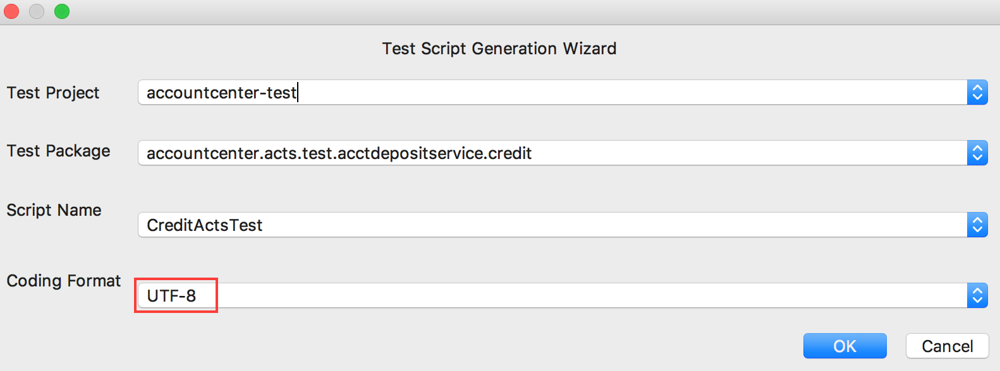
<div data-type="alignment" data-value="center" style="text-align:center">
  <div data-type="p">图1</div>
</div>

IDEA workspace的编码


<div data-type="alignment" data-value="center" style="text-align:center">
  <div data-type="p">图2</div>
</div>


## 数据源配置

acts配置数据源的目的，是为了在数据准备、数据清理、数据校验阶段，能够使用系统的数据源正确的进行db增删改查。
* 1.数据源配置 
在src/test/resource/config/acts-config.properties中，配置dal层的bundleName、数据源以及表的对应关系，以ds_开头，如下：
 ```
datasource_bundle_name =com.alipay.testapp.common.dal
ds_数据源bean1=逻辑表名1,逻辑表名2
ds_数据源bean2=逻辑表名3,逻辑表名4
 ```
其中数据源bean1、数据源bean2是应用代码里dal层的数据源bean的名称，支持多个数据源,后面的表名支持正则表达式，不需要带分库分表后缀，若有多个数据源，请注意配置的时候，某张表只能属于一个数据源；如下图：


<div data-type="alignment" data-value="center" style="text-align:center">
  <div data-type="p">图3</div>
</div>

* 2. 数据库直连
数据库直连，用于DB数据模型的生成。在src/test/resource/config/dbConf/下的devdb.conf或testdb.conf中配置如下：
```
      XXXX_url = jdbc:oracle:thin:@localhost:1521:cifdb
      XXXX_username = myname
      XXXX_password = mypswd
```
# 模型准备

## 快速理解ACTs中模型
在写测试用例的过程中，需要预先准备一些DB表、方法入参的数据，或者需要校验一些db表、返回结果的数据，这些数据可以以模版的形式保存下来，在编辑用例时，可以方便的导入这些数据到准备数据或者校验数据，实现数据复用。目前，ACTs模型可以分为db模型和类模型。

常规的测试用例编写，DB、方法入参、返回结果等领域模型的数据准备是通过测试代码组织的，随着业务复杂度，领域模型复杂度也在不断增加，尤其在金融级业务用，往往一个类或者数据表有数十个属性或者字段，类与类的嵌套也是随处可见，代码构造复杂对象变得十分困难且容易疏漏，问题频现：
* 表太多容易遗漏，排除时间太长；
* 表的字段名记不住，时不时写错；
* 接口入参数量多类型复杂，看见就头疼；
* 类的属性太多，容易遗漏重要属性；
* 嵌套构造对象，不断的new和set赋值；
* 继承和实现关系复杂，遗漏重要属性；
* ...
ACTs的模版有可以有效应对上述问题，通过将类和表固化为cvs，类的结构一目了然，通过类、数据表的模版可以快速的模版化地创建对象，并序列化到yaml文件中，使用ACTSs IDE可以方便的管理用例数据。

* 模型存储位置：

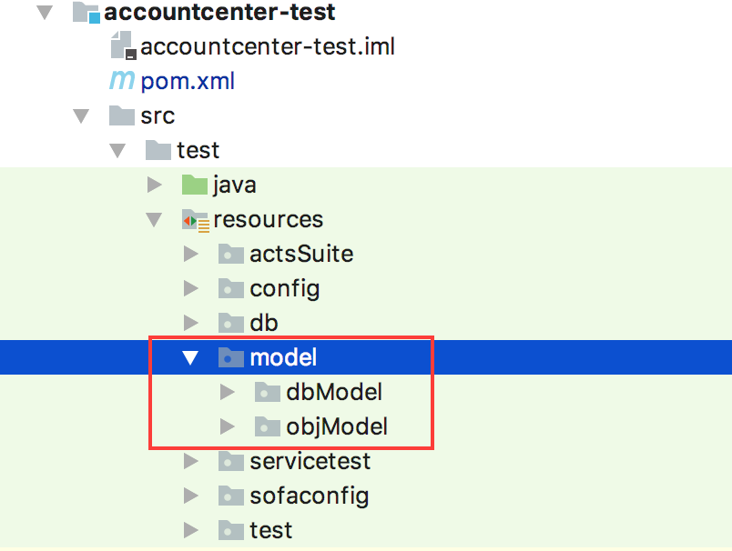
<div data-type="alignment" data-value="center" style="text-align:center">
  <div data-type="p">图4</div>
</div>

## 数据表模型生成

* 数据表模型样例：


<div data-type="alignment" data-value="center" style="text-align:center">
  <div data-type="p">图5</div>
</div>

（1）flag说明
````
Y: 插入
N：不插入
C：以此为where条件对插入后的数据进行清理
F：数据库函数
L: 大字段换行准备，准备方式为A=B;C=D
````
（2）用例编辑使用模型快速导入数据
使用ACTs IDE编辑DB表数据（包括准备表数据、期望表数据）时，可右键新增指定表的模型，用于直接从表模型的csv中导入表的全部字段和值，以便快速编辑。DB模版的使用可参考 准备期望db数据。

* 生成方法:
#### idea版插件生成表模版


<div data-type="alignment" data-value="center" style="text-align:center">
  <div data-type="p">图6</div>
</div>


<div data-type="alignment" data-value="center" style="text-align:center">
  <div data-type="alignment" data-value="center" style="text-align:center">
    <div data-type="p">图7</div>
  </div>
</div>


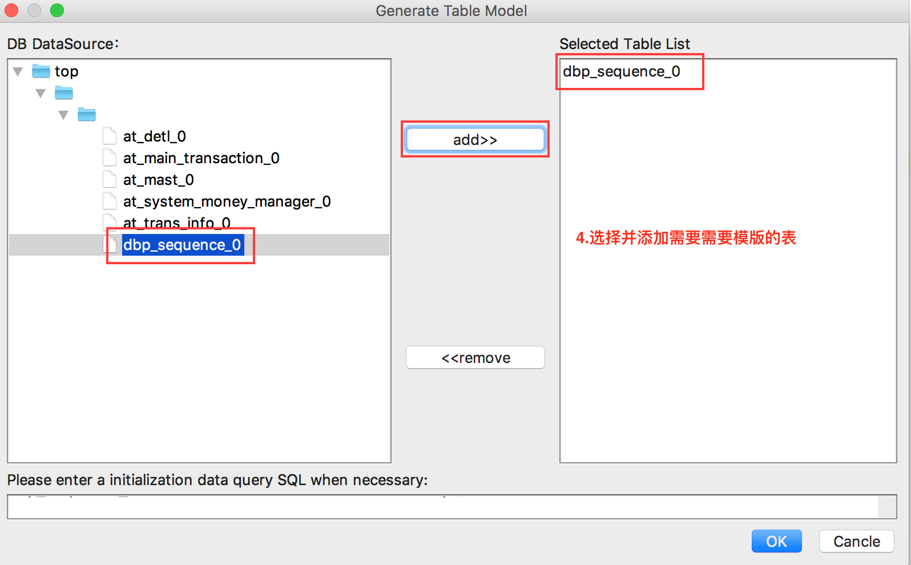
<div data-type="alignment" data-value="center" style="text-align:center">
  <div data-type="alignment" data-value="center" style="text-align:center">
    <div data-type="p">图8</div>
  </div>
</div>

点击OK后生成模板如下：

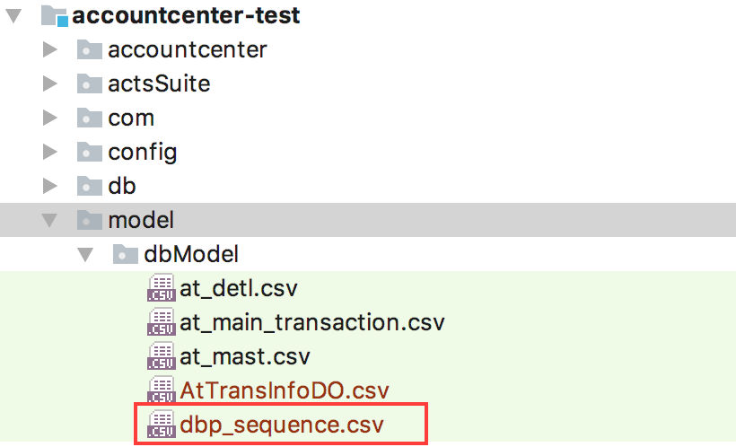
<div data-type="alignment" data-value="center" style="text-align:center">
  <div data-type="alignment" data-value="center" style="text-align:center">
    <div data-type="p">图9</div>
  </div>
</div>


idea版同时支持不配置直连获取表结构的方式生成表模型，即在DO类上右键根据DO生成表模型：
DO类上右击-->Acts功能-->生成DO模型：


<div data-type="alignment" data-value="center" style="text-align:center">
  <div data-type="p">图10</div>
</div>


<div data-type="alignment" data-value="center" style="text-align:center">
  <div data-type="p">图11</div>
</div>

## 对象模型生成

* 对象模型样例：

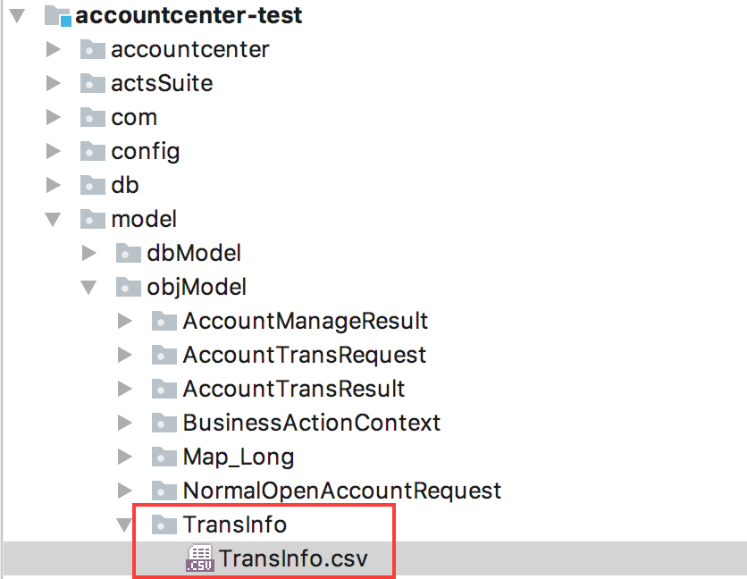
<div data-type="alignment" data-value="center" style="text-align:center">
  <div data-type="p">图12</div>
</div>


<div data-type="alignment" data-value="center" style="text-align:center">
  <div data-type="p">图13</div>
</div>

一个复杂对象是一个闭包，里面不但包含其自身模型，还包含其嵌套对象的模型。

（1）用例编辑使用模型快速导入数据：插件编辑复杂对象时（包括入参、返回结果、mock返回结果、消息DTO等）时，可右键新增指定的复杂对象模型，用于直接从复杂对象模型构建该类型对象并赋值，以便快速编辑。

（2）原子数据规则的构建：在使用一键生成用例功能时，需要配置原子数据规则并构建到数据库，复杂对象模型中的rule列就是用来自定义规则的地方，构建时将每一个复杂对象模型中rule列自定义的规则插入数据库，以便生成用例时从自定义的规则中取值。

* 生成方法:
有两种方式：1.待构建模型的类定义的任意方法上点击；2.接口定义的方法上点击。详细操作看下图示例。
使用IDEA的同学请注意：请先确保代码已编译，IDEA不会自动编译，手动mvn clean install或者打开自动编译，File->Settings->Build,Execution,Deployment->Compiler->Make project automatically。
#### idea版插件生成对象模型
（1）待构建模型的类定义的任意方法上点击，生成当前类的模型。


<div data-type="alignment" data-value="center" style="text-align:center">
  <div data-type="p">图14</div>
</div>

（2）接口定义任意方法上点击，生成当前接口中，所有方法的复杂入参、复杂返回结果的模型。


<div data-type="alignment" data-value="center" style="text-align:center">
  <div data-type="p">图15</div>
</div>


# 测试脚本
## 快速理解ACTs中的脚本
如果你是一个经常编写测试用例的同学，是不是经常苦于这样的问题：
* 自嘲成为一个精通if else get set的ctrl cv搬运工；
* 不断的assertEquals写得快吐了，重复性编码毫无创意；
* 少一个assert容易假绿，错一个败坏心情；
* 场景一旦复杂，测试代码比业务代码还要长，写起来痛不欲生；
* 每换一个应用，之前写的工具类就要搬一次；
* ...

左图为TestNG用例，右图为ACTs用例，重复性代码一去不回，代码体积明显缩小。区别于普通测试脚本，ACTs脚本继承自ActsTestBase类，封装了数据加载、驱动、执行引擎和校验规则，无需用户来组织清理数据、准备数据、执行用例和校验结果，对于简单业务可以做到零编码，极大释放代码编写和后期维护成本。

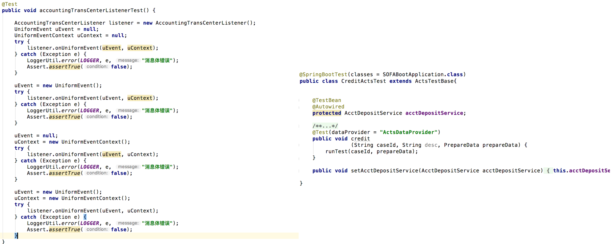
<div data-type="alignment" data-value="center" style="text-align:center">
  <div data-type="p">图16</div>
</div>

## 测试脚本生成

前提条件：__务必事先生成对象模型，即方法的入参、返回结果等模型生成，否则会造成acts视图编辑器不可预料的错误，如无法编辑、编辑数据不正确等。__

接口定义的方法上点击，选择Acts功能-->生成测试用例。


<div data-type="alignment" data-value="center" style="text-align:center">
  <div data-type="p">图17</div>
</div>


<div data-type="alignment" data-value="center" style="text-align:center">
  <div data-type="p">图18</div>
</div>


<div data-type="alignment" data-value="center" style="text-align:center">
  <div data-type="p">图19</div>
</div>

## 测试脚本运行
  方法：右键acts脚本中的被测方法，选择testng来执行测试脚本，如下图：


<div data-type="alignment" data-value="center" style="text-align:center">
  <div data-type="p">图20</div>
</div>

## 指定测试脚本运行

在src/test/resource/config/acts-config.properties中，配置test\_only属性，可以写一个正则表达式匹配需要运行的脚本描述。
1、 在src/test/resource/config/acts-config.properties中，配置test_only＝^T，表示只跑用例名称以T开头的用例，^T也可以换成其他正则表达式。
```
#指定执行用例描述以T开头的用例
test_only=^T
```

2、修改要跑的用例名称，双击用例名称，编辑用例用例名前面加T，就可以在run时仅跑用例名称以T开头的用例，可以编辑符合test\_only正则表达式的内容。

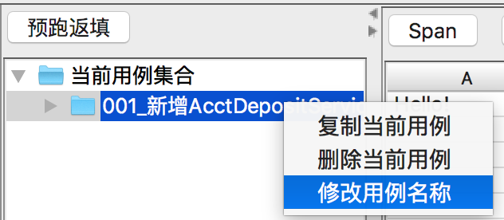
<div data-type="alignment" data-value="center" style="text-align:center">
  <div data-type="p">图21</div>
</div>


<div data-type="alignment" data-value="center" style="text-align:center">
  <div data-type="p">图22</div>
</div>


<div data-type="alignment" data-value="center" style="text-align:center">
  <div data-type="p">图23</div>
</div>


## 脚本用例拆分功能

默认每个测试脚本的所有用例数据保存在同一个yaml中，ACTs支持用例数据根据开关spilt_yaml_by_case来决定同一测试脚本的所有用例数据存储在一个yaml中还是每个case存储为一个yaml。开关默认为关闭，即同一测试脚本的所有测试数据存储在一个yaml中，开关打开方法：在acts-config.properties中配置:

```
spilt_yaml_by_case=true
```

开关打开后，新生成的测试脚本的数据存储方式就是一个case一个yaml，yaml的名称为caseId，拆分的方式可以降低多人研发同一接口带来的文件冲突问题。 此外，为了支持将老的yaml文件按用例拆分，acts提供了工具类，如下，支持将指定脚本下，指定路径的yaml文件按用例拆分。

   __BaseDataUtil.saveYamlDataToCaseByCase__

* 注意：拆分后，建议先给原有yaml重命名做备份，然后打开用例编辑器检查拆分后的文件内容是否正确，确认无误后可删除原有yaml文件。一般单个yaml文件和拆分后的yaml文件不能并存。


## 编码方式准备数据
ACTs提供了数据自定义api接口，封装于ActsRuntimeContext类中，如下：
(1)快速获取和设置自定义参数
获取全部自定义参数：getParamMap getParamMap()
按key获取：Object getParamByName(String paraName)
新增自定义参数：void addOneParam(String paraName, Object paraObj)
替换自定义参数：void setParamMap(Map<String, Object> paramMap)
泛型方式获取自定义参数，避免强转： T getParamByNameWithGeneric(String paraName)

(2)快速获取和设置用例入参
获取所有入参：List getInputParams() 
按位置获取：Object getInputParamByPos(int i)
新增用例参数：void addInputParam(Object obj) 

(3)快速获取和设置期望结果
获取期望结果：Object getExpectResult() 
设置期望结果：Boolean setExpectResult(Object objToSet)

## Mock功能使用
mock功能目前是采用Mockito的方案，如下配置使用；具体资料见（[Mockito英文文档](https://static.javadoc.io/org.mockito/mockito-core/2.18.3/org/mockito/Mockito.html)和[Mockito中文文档](https://github.com/hehonghui/mockito-doc-zh)
### 增加依赖
```
<dependency>
    <groupId>org.springframework.boot</groupId>
    <artifactId>spring-boot-starter-test</artifactId>
    <scope>test</scope>
</dependency>
```
默认spring test 依赖的mockito版本是1.x，想要升级的可以再引入相应的版本
```
<dependency>
    <groupId>org.mockito</groupId>
    <artifactId>mockito-core</artifactId>
    <version>2.18.3</version>
</dependency>
```

__Mockito__ 用于测试时进行打桩处理，通过它可以指定某个类的某个方法在什么情况下返回什么样的值。Mockito库能够Mock对象、验证结果以及打桩(stubbing)，如下：

__demo1__
```
@SpringBootTest(classes = SOFABootApplication.class)
@TestExecutionListeners(listeners = MockitoTestExecutionListener.class)
public class RegisterUserActsTest extends ActsTestBase {

    @TestBean
    @Autowired
    // 这是测试类
    public UserService userService;

    @MockBean
    // 这是要mock的bean
    public AccountManageFacadeClient accountManageFacadeClient;

    @Test(dataProvider = "ActsDataProvider")
    public void registerUser
                (String caseId, String desc, PrepareData prepareData) {
        runTest(caseId, prepareData);
    }

    @Override
    public void beforeActsTest(ActsRuntimeContext actsRuntimeContext) {
        super.beforeActsTest(actsRuntimeContext);
        AccountManageResult accountManageResult = new AccountManageResult();
        accountManageResult.setAccountNo("testAccount");
        accountManageResult.setOperateDt(new Date());
        accountManageResult.setSuccess(true);
        Mockito.when(accountManageFacadeClient.openAccount(Mockito.any(NormalOpenAccountRequest.class))).thenReturn(accountManageResult);
    }

    public void setUserService(UserService userService) {
        this.userService = userService;
    }
}
```

# 用例编辑器使用
## 打开插件编辑器

在package视图下，右键含@Test注解的函数名，Acts 功能-修改测试用例。如下图：


<div data-type="alignment" data-value="center" style="text-align:center">
  <div data-type="p">图24</div>
</div>


## 编写测试数据
## 准备入参
根据被测的接口方法的入参（类型、顺序、数量）正确准备入参数据。简单类型：String、Date、Integer、Float、Double、Long、Short、Byte（封装类型包含其对应的基本类型，即int、float等）。复杂类型：List、Map、Set、自定义类、java定义的类以及前面五者的嵌套等。
### 简单入参
入参设置上右键－>模版选择->简单入参选择：


<div data-type="alignment" data-value="center" style="text-align:center">
  <div data-type="p">图25</div>
</div>

导入简单入参后，值直接在这里填写；
自上而下表示被测接口方法的第1、第2、第3等参数，右键可以调节顺序。


<div data-type="alignment" data-value="center" style="text-align:center">
  <div data-type="p">图26</div>
</div>


### 复杂入参


<div data-type="alignment" data-value="center" style="text-align:center">
  <div data-type="p">图27</div>
</div>

接着 __生成测试用例__，然后 __打开编辑器__，可以看到复杂数据对象，直接进行编辑。
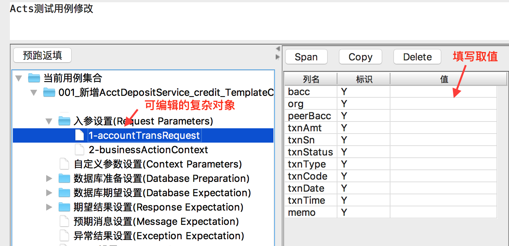
<div data-type="alignment" data-value="center" style="text-align:center">
  <div data-type="p">图28</div>
</div>

如果生成用例没有识别到入参，可以先生成入参模型后，再在插件编辑器中自行模版选择添加：入参设置上右键－>模版选择->复杂类型选择：<br >


<div data-type="alignment" data-value="center" style="text-align:center">
  <div data-type="p">图29</div>
</div>

### list


<div data-type="alignment" data-value="center" style="text-align:center">
  <div data-type="p">图30</div>
</div>


<div data-type="alignment" data-value="center" style="text-align:center">
  <div data-type="p">图31</div>
</div>


### map
以示例2为例（Set于此类似）
图32中它的第参数为Map&lt;String, Object&gt;类型，生成用例。由于Object不是具体类型，如果要设置Object为复杂对象，则需要去编辑yaml。例如设置Object为AccountTransResult类型，则按照如下编辑：

<div data-type="alignment" data-value="center" style="text-align:center">
  <div data-type="p">图32</div>
</div>


<div data-type="alignment" data-value="center" style="text-align:center">
  <div data-type="p">图33</div>
</div>

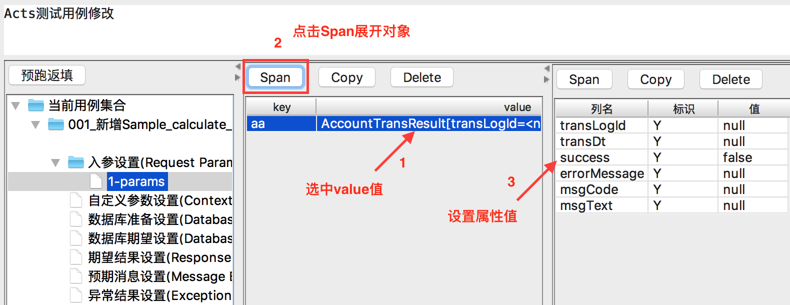
<div data-type="alignment" data-value="center" style="text-align:center">
  <div data-type="p">图34</div>
</div>

### enum
代码样例：

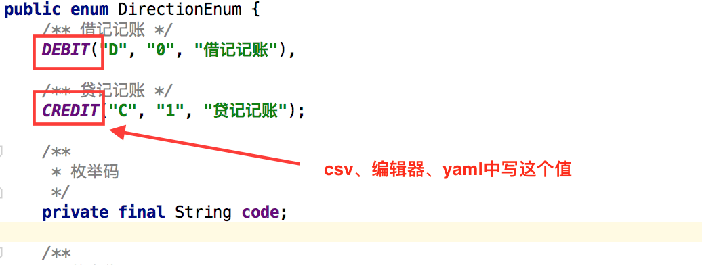
<div data-type="alignment" data-value="center" style="text-align:center">
  <div data-type="p">图35</div>
</div>

1.如果枚举嵌套在其他类中，则在该类的模版中(即该类对应的csv中)设置枚举的值为DEBIT；
2.ACTS IDE编辑器中，编辑如下：

  <div data-type="alignment" data-value="center" style="text-align:center">
    <div data-type="p">图36</div>
  </div>
</div>

3.用例数据yaml中，如图37：
```
interestRecoverTypeEnum: !!com.alipay.fc.loancore.common.util.enums.InterestRecoverTypeEnum 'ALL'
```


<div data-type="alignment" data-value="center" style="text-align:center">
  <div data-type="p">图37</div>
</div>

### 编码方式准备入参
覆盖prepare方法，通过actsRuntimeContext的方法，快速获取和设置用例入参，如图38所示：
```
1. 获取所有入参：List getInputParams()
2. 按位置获取：Object getInputParamByPos(int i)
3. 新增用例参数：void addInputParam(Object obj)
```


<div data-type="alignment" data-value="center" style="text-align:center">
  <div data-type="p">图38</div>
</div>


## 准备db数据

### 准备db数据-单列场景
如图39，在数据库准备设置位置右键，选择好要插入的db模板（请先确保该db模板已经生成），图中1、2、3步骤之后点击OK即插入db准备模板，如图41可对要插入db的数据进行编辑：<br >


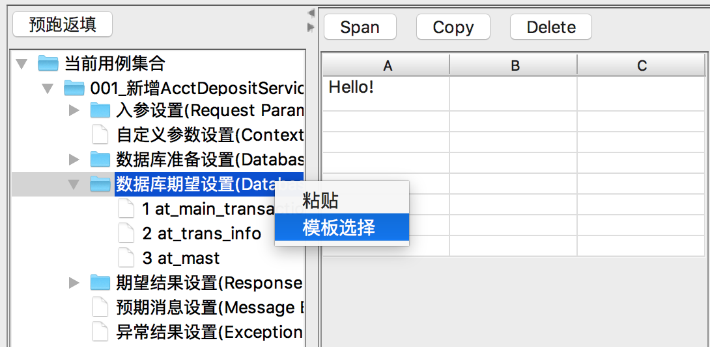
<div data-type="alignment" data-value="center" style="text-align:center">
  <div data-type="p">图39</div>
</div>

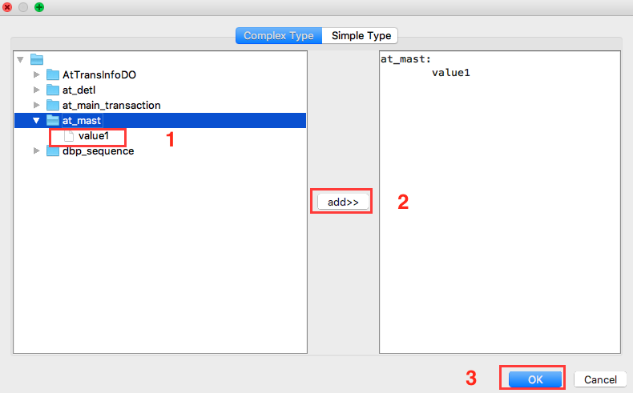
<div data-type="alignment" data-value="center" style="text-align:center">
  <div data-type="p">图40</div>
</div>

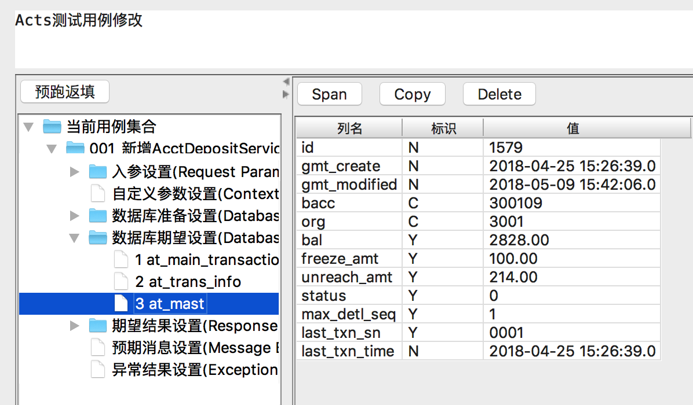
<div data-type="alignment" data-value="center" style="text-align:center">
  <div data-type="p">图41</div>
</div>


### 准备db数据-多列场景
选中一列数据，点击复制，按此方法可复制多列数据，然后进行编辑即可：

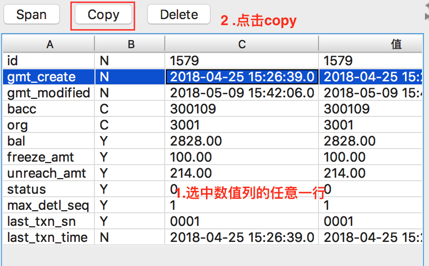
<div data-type="alignment" data-value="center" style="text-align:center">
  <div data-type="p">图42</div>
</div>

### 准备db数据-flag说明
数据依赖标记：
```
Y: 插入
N：不插入
C：以此为where条件对插入后的数据进行清理
F：数据库函数
L: 大字段换行准备，准备方式为A=B;C=D
```

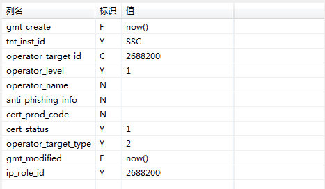
<div data-type="alignment" data-value="center" style="text-align:center">
  <div data-type="p">图43</div>
</div>

## 准备期望结果数据

生成期望结果的对象模型后，在插件编辑器中，期望结果设置右键－>模版选择，见下图。


<div data-type="alignment" data-value="center" style="text-align:center">
  <div data-type="p">图44</div>
</div>

### 准备期望result数据-flag说明
```
Y: 校验
N：不校验
D：时间偏移值比较，如D200
ME：map默认全key校验，ME则以期望key为准，实际值多余期望值的key不予校验
```

对于返回结果的时间Date类型字段校验说明：
1. Y | null －> 代表期望为null
2. Y | 2015-01-01 00:00:00 －> 代表期望为2015-01-01 00:00:00
3. N | null －> 代表不校验
4. D200 | 2015-01-01 00:00:00/null －> 代表与2015-01-01 00:00:00/new Date()相差200秒

### 编码方式准备期望result数据
覆盖prepare方法，通过actsRuntimeContext的如下方法，快速获取和设置期望结果
1. 获取期望结果：Object getExpectResult() 
2. 设置期望结果：Boolean setExpectResult(Object objToSet) 

## 准备期望db数据
### 准备期望db数据-单列场景
在数据库期望设置里配置，操作参考[准备db数据-单列场景](#准备db数据-单列场景)
### 准备期望db数据-多列场景
在数据库期望设置里配置，操作参考[准备db数据-多列场景](#准备db数据-多列场景)

### 准备期望db数据-flag说明
数据校验标记：
```
Y: 校验
N：不校验
C：以此为条件select然后比较，如果结果有多个，则返回的结果所有记录都要和当前需要校验的数据进行校验。
CN： 这个flag表名当前这张表中以C和CN为条件查询出的结果为空
D200：表示对比时间的时候误差200s之内都算通过，日期类型的格式为：today
L： 数据库大字段换行数据校验，准备方式为A=B;C=D
P：db大字段校验，以期望结果的kv为基准，对db大字段里的kv进行校验，要求db里的kv之间是换行分隔
R：正则匹配校验
```

## 准备期望异常数据
### 编码方式准备期望异常数据
部分系统封装的异常类没有默认构造函数，这样通过模版添加的异常结果在加载yaml时会有问题（无默认构造函数无法构造当前类），需要通过写代码的方式，结合自定义参数，编写异常脚本，如下图：


<div data-type="alignment" data-value="center" style="text-align:center">
  <div data-type="p">图45</div>
</div>


## 准备自定义数据
### 自定义数据-用途
用户自定义的各类型数据，用于测试过程中自由使用
### 自定义数据-数据类型
数据类型可参考 入参 部分
### 编码方式准备自定义数据
快速获取和设置自定义参数：
```
1.获取全部自定义参数：getParamMap getParamMap() 
2.按key获取：Object getParamByName(String paraName) 
3.新增自定义参数：void addOneParam(String paraName, Object paraObj)
4.替换自定义参数：void setParamMap(Map<String, Object> paramMap) 
5.以范型方式获取自定义参数：T getParamByNameWithGeneric(String paraName)
```

## 不同数据类型编辑方式
### 简单类型编辑
以自定义参数设置添加简单类型数据为例。如下图，自定义参数设置右键 - 模板选择，弹框填写入参名字：


<div data-type="alignment" data-value="center" style="text-align:center">
  <div data-type="p">图46</div>
</div>


<div data-type="alignment" data-value="center" style="text-align:center">
  <div data-type="p">图47</div>
</div>

选择string类型，在下方编辑框填写值即可，生成后也可自行编辑：


<div data-type="alignment" data-value="center" style="text-align:center">
  <div data-type="p">图48</div>
</div>


<div data-type="alignment" data-value="center" style="text-align:center">
  <div data-type="p">图49</div>
</div>

### 复杂对象编辑
以自定义参数设置添加复杂对象数据为例

参照[简单类型编辑](#简单类型编辑)，在弹框填写好入参名字。然后在模板选择列表中（如果找不到想要的复杂对象，请先生成相应的数据模板），选择一个复杂对象，然后add，点击OK确认。


<div data-type="alignment" data-value="center" style="text-align:center">
  <div data-type="p">图50</div>
</div>


如果该复杂对象中还包含复杂对象，选中该行，点击展开（如果没反应，尝试光标定位value列，然后点击展开），则数据会展开至当前右边的编辑区。如果还有复杂对象，可做类似操作继续进行展开。

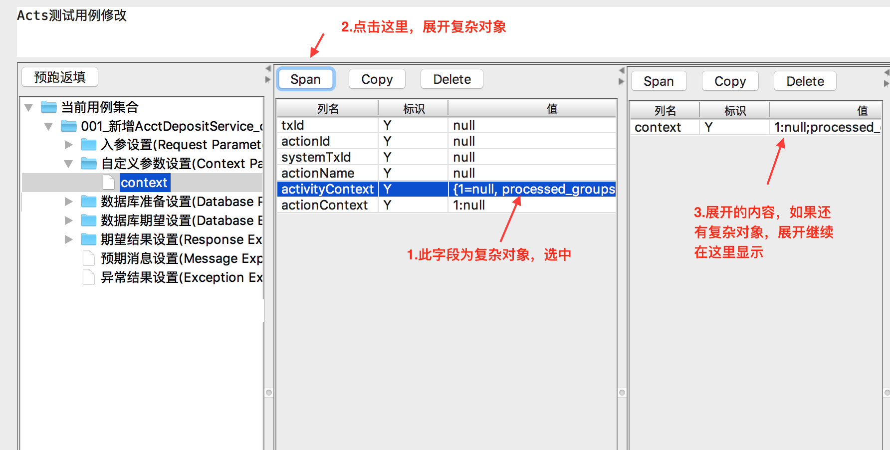
<div data-type="alignment" data-value="center" style="text-align:center">
  <div data-type="p">图51</div>
</div>

### list编辑
以自定义参数设置添加List<String>为例，模板选择List模板：


<div data-type="alignment" data-value="center" style="text-align:center">
  <div data-type="p">图52</div>
</div>

自行编辑，然后可选中第一列进行复制，如图53：


<div data-type="alignment" data-value="center" style="text-align:center">
  <div data-type="p">图53</div>
</div>

### map编辑
可参照入参中有关map部分。

### enum编辑
可参照入参中有关enum部分。

## 右键功能说明
### 复制当前节点


<div data-type="alignment" data-value="center" style="text-align:center">
  <div data-type="p">图54</div>
</div>

### 删除当前节点

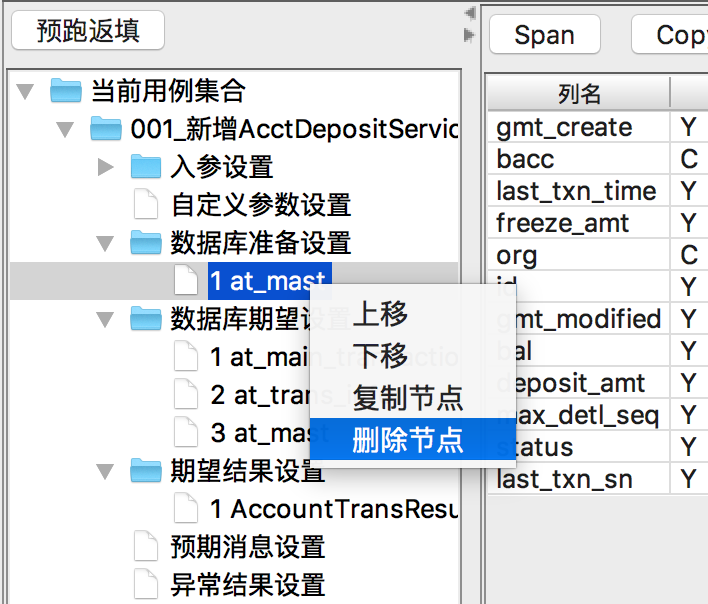
<div data-type="alignment" data-value="center" style="text-align:center">
  <div data-type="p">图55</div>
</div>

## 修改用例名称
在用例名上右键，修改用例名称：

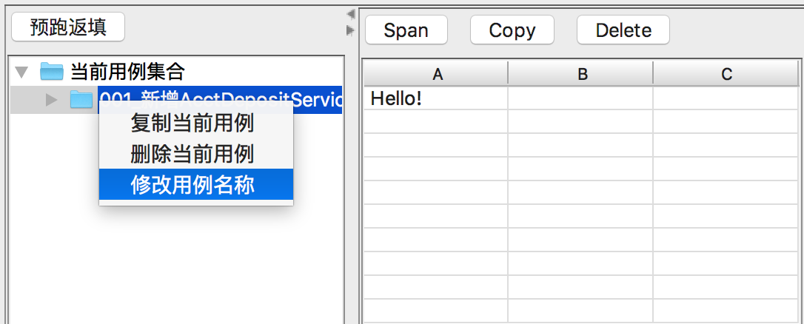
<div data-type="alignment" data-value="center" style="text-align:center">
  <div data-type="p">图56</div>
</div>

## 复制用例
在用例名上右键-复制当前用例：


<div data-type="alignment" data-value="center" style="text-align:center">
  <div data-type="p">图57</div>
</div>

## 预跑返填
为了提高期望数据值（结果、表数据、消息）的快速填写，框架提供了预跑返填功能，一个用例准备好入参、准备数据等，用例执行的基本数据后，可先不必填写期望数据，用例运行起来后，框架可自动抓取运行结果、表变更数据、消息等，运行后打开编辑器点击“预跑返填”，可填充指定用例的期望数据。具体使用案例：
前置条件：[配置acts日志](./LogConfiguration.md)
```
1. acts-config.properties配置文件中开关设置：collect_case_result=true；
2. 正常执行ACTs用例；
3. 通过插件反填结果，需要选中要操作的那一行
```


<div data-type="alignment" data-value="center" style="text-align:center">
  <div data-type="p">图58</div>
</div>
这一步只是框架提供的便捷特性，在预跑结果反填之后请严格测试每一条数据的正确性，避免代码缺陷产生遗漏。

### 一键返填

选中需要反填的用例，确认即可。


<div data-type="alignment" data-value="center" style="text-align:center">
  <div data-type="p">图59</div>
</div>

# 扩展功能
## 自定义引擎各个阶段

可以在测试脚本中，或者基类中重写ActsTestBase中的方法。

(1)重写prepare，execute，check，clear等。可以通过在super.prepare()之前或者之后进行某些操作。

(2)重写process方法，在super.process()之前或之后进行操作。可将整个脚本重新编排，例如在现有的清理－》准备－》执行－》校验流程中增加一些个性化的步骤。

(3)重写beforeActsTest、afterActsTest，可以在每一个用例运行前后做一些个性化的操作，如准备上下文、缓存刷新等。

## 参数化（目前仅支持String的参数化）

在结果期望和数据期望里面可以使用“$变量名”来标识某个值是变量，测试脚本中可以把值设置进去；
支持范围：入参、返回结果、数据库表字段。

使用方法：
1、界面以$开头定义变量：

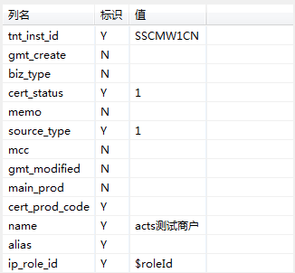
<div data-type="alignment" data-value="center" style="text-align:center">
  <div data-type="p">图60</div>
</div>

注：添加在自定义参数的参数，也可以直接在上述支持的地方引用

2、代码中给变量赋值：

```
   @Override
    public void beforeActsTest(ActsRuntimeContext actsRuntimeContext) {
        actsRuntimeContext.paramMap.put("roleId", "123");
        actsRuntimeContext.refreshDataParam();//刷新会使用变量的实际值替换prepareData里的变量,实时刷新）

    }
```

在写db数据期望的时候，也可以通过"="符号来进行赋值，表示这个值来自于查询结果。

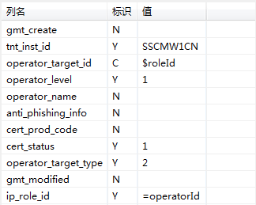
<div data-type="alignment" data-value="center" style="text-align:center">
  <div data-type="p">图61</div>
</div>


后面的表就可以使用这个变量作为值。

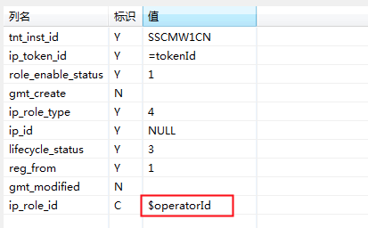
<div data-type="alignment" data-value="center" style="text-align:center">
  <div data-type="p">图62</div>
</div>


假设接口会向2张表插数据

| id_A | value_A |
| :--- | :--- |
| 123 | abc |


| id_B | value_B |
| :--- | :--- |
| abc | efg |


查询的时候要先通过接口返回的A表的id\_A 查到 value\_A, 然后把value\_A作为 B表的查询条件，在插件上面可以这样写：

| 字段 | flag | 值 |
| :--- | :--- | :--- |
| id_A | C | $param1 |
| value_A | Y | =param2 |


| 字段 | flag | 值 |
| :--- | :--- | :--- |
| id_B | C | $param2 |
| value_B | Y | efg |

上面操作说明：

1）=param2和\$param2的操作，表示框架会先从A表查出value_A 然后 select from 表B where id_B = value_A，进而得到全部B表的属性值

2）$param1表示可以在代码中对id\_A赋值，代码形如：
```
actsRuntimeContext.paramMap.put("param1","123");
```
表示对变量param1赋值123，上述代码可以写到脚本的beforeActsTest里面，这样在查询A表之前，框架就会将123赋值给id\_A

## 参数组件化

__目前仅支持String的组件化__

如果属性是需要动态生成的字符串，例如某些ID，可以通过“@”符号来调用一个组件生成这个属性，组件要放在跟test同级的component包下，即：com.corpname.appname.acts.component (!!!这里appname是系统名，corpname是公司名，如alipay)。
```
public class MyComponent {
    @TestComponent(id = "test")
    public String test(String param) {
        return param+"123";
    }
}
```

<br/>并通过acts-config.properties配置指明参数化组件使其生效，多个组件使用英文逗号","分隔，末尾注意不必要的空格。
```
param_components = IdGenerateComponent,NoGenerateComponent
```


<div data-type="alignment" data-value="center" style="text-align:center">
  <div data-type="p">图63</div>
</div>

如果属性值为：@test?param=xxxx,就会自动替换为xxxx，组件的ID要保证唯一,否则默认调用第一个，如果声明了一个无参组件方法，调用方式为@test即可，新版本插件中支持组件化参数通过变量传入：@test?param=\$id，实际执行时会替换id的值为实际值
脚本中也可以通过代码调用:
```
  ActsComponentUtil.run("@test?param=123");
```
自定义组件多个参数的场景使用&分割参数：@test?param1=xxx&param2=yyy

## db工具类

1.指定数据源进行表的访问。

框架ActsDBUtils方法中提供了DB的指定数据源访问，用于个性化DB操作。例如某张表的某条纪录不是准备数据、也不是校验数据，但是需要在运行后删掉或更新，此时就需要用到该工具操作db数据。

__使用前配置__

使用指定数据源方式需要在acts-config.properties文件中首先将要指定的数据源进行配置，配置例子如下：

```
datasource_bean_name_fcdetConfigZdalDataSource=com.alipay.fc.debittrans.common.dal;fcdetConfigZdalDataSource

整体配置的格式为：datasource_bean_name_XXXX(数据源名字)=XXX(数据源所在的bundle);XXXX(数据源名字)

```

__指定数据源方法__

ActsDBUtils工具类中指定数据源方法说明：

```
public static int getUpdateResultMap(String sql,String tableName,String dbConfigKey);

该方法用于指定数据源进行表的增，删，改的操作。sql为标准sql语句，tableName为逻辑表名，dbConfigKey为该
表所在的逻辑数据源配置，与acts-config.properties配置的XXXX(数据源名字)相同。

public static List<Map<String, Object>> getQueryResultMap(String sql, String tableName,String dbConfigKey);

该方法用于指定数据源进行表的查询操作，以上两个方法都是原子化的DB表的操作，如果有其他的DB需求可以在上面进行
封装。
```

2.不指定数据源进行表的访问。

不指定数据源进行表访问的方法采用了ACTS框架默认根据表名搜索数据源的方式，工具方法的使用步奏如下：

__使用前配置__
```
datasource_bundle_name=com.alipay.fc.debittrans.common.dal
ds_fcdetConfigZdalDataSource= det_system_param,det_account_summary_config

整体配置的格式为：
datasource_bundle_name=数据源所在bundlename
ds_数据源名字=该数据源下的逻辑表名
```

__不指定数据源方法__
```
public static int getUpdateResultMap(String sql, String tableName);

该方法用于指定数据源进行表的增，删，改的操作。sql为标准sql语句，tableName为逻辑表名

public static List<Map<String, Object>> getQueryResultMap(String sql, String tableName);

该方法用于指定数据源进行表的查询操作

```

## acts各阶段注解扩展

被打上注解的自定义方法，可以在注解标示的不同阶段扩展个性化操作。

```
    @BeforeTable
    public void beforeTableExecute(String tbName, String groupId) {
        System.out.println("每张表执行前执行!!");
    }

    @AfterTable
    public void afterTableExecute(String tbName, String groupId) {
        System.out.println("每张表执行后执行!!");
    }

    @BeforeClean
    public void beforeClean(ActsRuntimeContext actsRuntimeContext) {
        System.out.println("数据清理前执行!!");
    }

    @AfterClean
    public void afterClean(ActsRuntimeContext actsRuntimeContext) {
        System.out.println("数据清理后执行!!");
    }

    @BeforePrepare
    public void beforePrepare(ActsRuntimeContext actsRuntimeContext) {
        System.out.println("数据准备前执行!!");
    }

    @AfterPrepare
    public void afterPrepare(ActsRuntimeContext actsRuntimeContext) {
        System.out.println("数据准备后执行!!");
    }

    @BeforeCheck
    public void beforeCheck(ActsRuntimeContext actsRuntimeContext) {
        System.out.println("数据check前执行!!");
    }

    @AfterCheck
    public void afterCheck(ActsRuntimeContext actsRuntimeContext) {
        System.out.println("数据check之后执行!!");
    }

    @Executor(group = "", Order = 0)
    public void excute(ActsRuntimeContext actsRuntimeContext) {
        System.out.println("多阶段接口执行");
    }

```

使用中只需要在想要执行的方法上打上如上标签即可，被注解方法的参数需要符合上述示例中的参数，框架会自动传递表名，groupid，acts上下文参数供注解方法使用。

