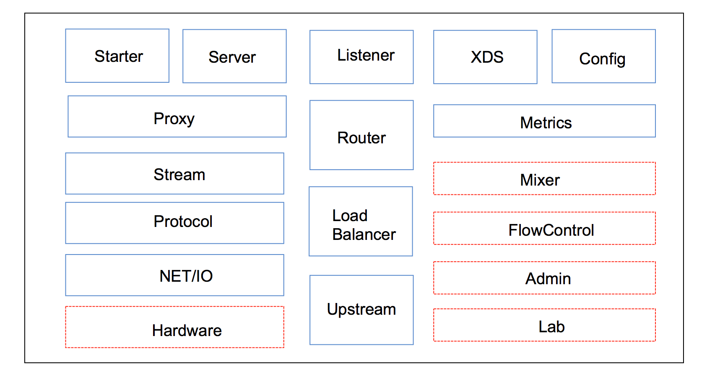
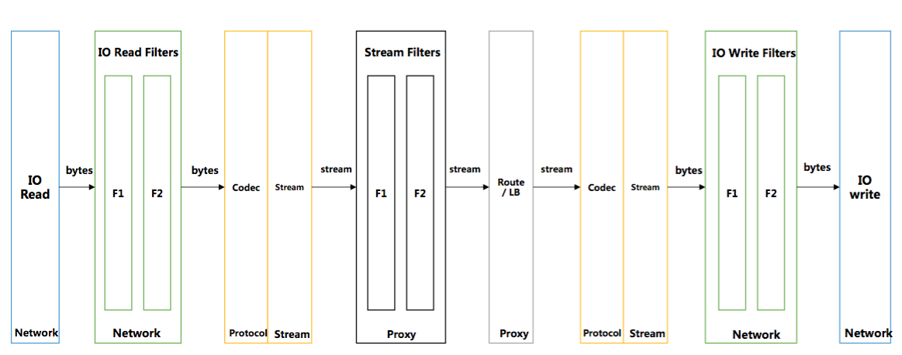
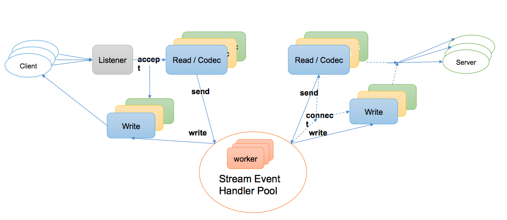
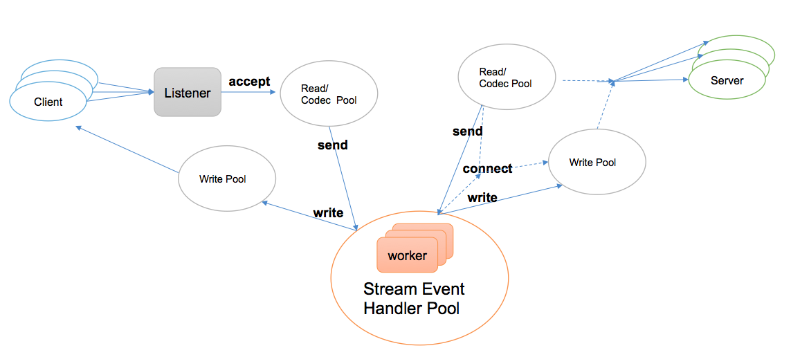
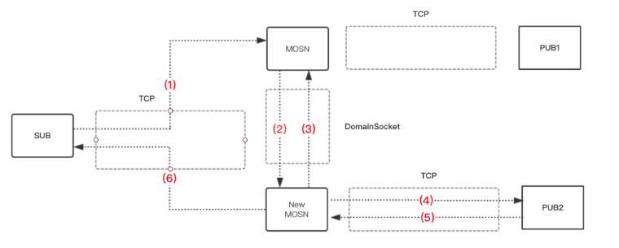

# SOFAMosn introduction

## Background

In the cloud native era, Service Mesh is a dedicated infrastructure layer for providing secure, fast, reliable, and intelligent service-to-service communication. It greatly facilitates the connection, management, and monitoring of microservices, thereby accelerating the practice of microservices. For more information about Service Mesh, see
[Journey to Service Mesh under Ant Financial's large-scale microservices architecture](http://www.servicemesher.com/blog/the-way-to-service-mesh-in-ant-financial/).

As a leading financial service provider in China, Ant Financial has high requirements on the performance, stability and security of the system architecture. Due to complex operations architecture, in order to achieve high availability and fast iteration, Ant Financial is fully embracing the trends of microservices and cloud native trend. Service Mesh has become the important driving force for implementing Ant Financial's critical microservices-based components, such as SOFA5 and K8S-compatible Sigma container platform.

In the selection of Service Mesh implementation plan, Istio outstands in terms of function implementation, stability, scalability and community attention. Its data plane Envoy is characterized by excellent design, extensible xDS API and high performance. Therefore, Ant Financial gives exclusive attention on Istio.

However, Envoy is developed in C++, which doesn't match Ant Financial's technology stack and cannot be compatible with the current operations system. Many factors cause that Ant Financial cannot directly use Istio. After investigation and study, we found that GoLang, which is one of the mainstream languages in the cloud computing era, also has high forwarding performance, so we plan to develop the high-performance Sidecar with GoLang and integrate it with Istio, then SOFAMosn comes in to being.

## Getting to know SOFAMosn

To put it simply, SOFAMosn is a Service Mesh data plane agent developed by using GoLang. Jointly developed by Ant Financial's System Group Network Team, Ant Financial Middleware Team and UC Team, SOFAMosn is designed to provide distributed, modular, observable, and intelligent agent capabilities. It provides programmable, event-driven, scalable, and high-throughput capabilities through a modular and layered decoupling design.

  
Currently, SOFAMosn supports Istio's API, and interfaces with Pilot through XDS API. In this way, SOFAMosn can obtain the configuration information pushed by the control plane to implement the proxy function. In practice, you can integrate SOFAMosn with Istio to implement Service Mesh components (for example, overall [SOFAMesh](https://github.com/alipay/sofa-mesh) implementation project), or use SOFAMosn alone as a business gateway. SOFAMosn benefits you from the following aspects:

- As written in GoLang, SOFAMosn has high development efficiency and can seamlessly integrate with k8s and other technologies in the cloud native era, thus accelerating the implementation of microservices.
- SOFAMosn serves as a proxy to coordinate the calls among the components using Java, C++, GoLang, PHP, Python, and other heterogeneous languages to avoid the repeated development of the components that have multi-language versions, thus improving the business development efficiency. Currently, SOFAMosn has been used as a bridge for cross-language RPC calls in Ant Financial.
- SOFAMosn provides flexible traffic scheduling capabilities to better support the operations system, including blue-green upgrade, failover and others.
- SOFAMosn provides TLS, service authentication and other capabilities to meet the requirements of service encryption and security.

Currently, SOFAMosn has been open sourced on Github. You are welcome to join us and build a boutique GoLang Sidecar together with us. 

Project address:
[https://github.com/alipay/sofa-mosn](https://github.com/alipay/sofa-mosn).

To help you better know SOFAMosn, this article introduces SOFAMosn's features in a comprehensive way, so you can have an overall understanding on SOFAMosn. For more details, pay attention to the subsequent articles. 

The content described in this article includes:

* How does SOFAMosn work?
* How does SOFAMosn implement proxy function?
* How does SOFAMosn improve GoLang's forwarding performance?
* How does SOFAMosn optimize memory usage?
* How does SOFAMosn implement high availability?
* How does SOFAMosn support extensions?
* How does SOFAMosn ensure security?

## How does SOFAMosn work?

SOFAMosn is essentially a layer 4-7 proxy, so it can be deployed as a standalone process in the same physical machine or virtual machine (VM) with the user programs acting as Sidecar. Of course, it can independently run as a standalone gateway on a single host or VM.

As shown in the following figure, SOFAMosn (MOSN for short) and Service are deployed on the same Pod. The MOSN is listening on a fixed port. A positive request connection includes the following steps:

* ServiceA which serves as the client can use any languages and any supported protocols (such as HTTP1.x，HTTP2.0 and SOFARPC) to send sub/pub, request and other messages to MOSN.
* MOSN takes over ServiceA's service discovery, routing, load balancing and other capabilities, and forwards the ServiceA's request messages to the upstream MOSN through protocol conversion. 
* The upstream MOSN forwards the received requests to ServiceB through protocol conversion.

The reverse request connection works in a similar way. MOSN takes over the requests between Service A and Service B.

Notes:

1. You can use MOSN to take over the client's requests only. MOSN can directly access Server, and the trace is Client -> MOSN -> Server, and vice versa.
2. MOSN's upstream and downstream protocols can be configured as any one of the protocols that are currently supported.

## Architecture design

To know the proxy capability of SOFAMosn, you must get insight into the implementation framework of SOFAMosn and learn how the data flows inside it. This section introduces the modules that make up SOFAMosn and the layered design of SOFAMosn in sequence.

### Constituent modules

SOFAMosn consists of the following modules:

* `Starter` is used to start MOSN, including starting from configuration file or in XDS mode. `Config` is used for parsing the configuration file; `XDS` is used to interact with Istio and get the configuration pushed from Pilot.
* After the MOSN parses the configuration, it generates `Server` and `Listener`. `Listener` contains listener port, Proxy, Filter, Log and other information; `Server` contains Listener, which is the abstraction of MOSN at runtime. When `Server` starts running, it enables Listener and receives connections.
* After the MOSN is running, it also generates `Upstream` related information for maintaining the backend Cluster and Host information.
* When the MOSN forwards requests, it picks Host through `Router` and `LoadBalancer` in the Cluster of Upstream.
* `Router` is the routing module of MOSN. Currently, MOSN supports routing by label.
* `LoadBalance` is the load balancing module of MOSN, which supports WRR and Subset LB.
* `Metrics` is used to record and track the data at the protocol layer.
* `Hardware` is the hardware technology planned for MOSN, including using acceleration cards for TLS acceleration and using DPDK for protocol stack acceleration.
* `Mixer` is used to perform service authentication for requests. This module is in development.
* `FlowControl` is used to control backend traffic. This module is in development.
* `Lab` and `Admin` are for experiment. Both modules are in development.

### Layered design

In terms of layering, SOFAMosn divides the overall functions into four layers: network IO layer, protocol processing layer, flow processing layer, and forwarding and routing layer. The functions inside each layer are closely cohered, so each layer can implement an independent function. The four layers cooperate with each other to complete proxy forwarding.

As shown in the following figure, when MOSN performs proxy processing on the data stream, the inbound data passes through the network IO layer (NET/IO), protocol processing layer (Protocol), flow processing layer (Streaming), and forwarding and routing layer (Proxy) in turn. The outbound and inbound processes are basically the reverse.

The functions and corresponding features of each layer are as follows:

+ The NET/IO layer encapsulates IO read and write and provides an extensible IO event subscription mechanism. It has the following features:
    + Shield IO processing details
    + Customize the management of network connection lifecycle
    + Programmable network model, core method, monitoring metrics
    + Scalable plugin mechanism
    + Applicable to client/server
    + Implemented based on GoLang net package

+ The Protocol layer provides the capability to serialize/deserialize data according to different protocols. It has the following features: 
    + Define the codec core data structure.
    + Three-phase: Headers + Data + Trailers
    + Use a unified encoder/decoder core interface.
    + Provide a general encoding/decoding engine.
        + Encoding: Encode business data and send data according to control instructions.
        + Decoding: Decode IO data and notify subscribers via extension mechanism.

+ The Streaming layer ensures upward protocol consistency, takes charge of the STREAM lifecycle, manages the request stream behavior in Client/Server mode, and provides a pooling mechanism for the Client-side Stream. It has the following features: 
    + Define the encoder/decoder core interface on the  Streaming layer to provide an extensible plugin mechanism.
        + Different protocols encapsulate STREAM details according to their own protocol flows.
    + Support multiple communication models, including the three typical flow characteristics of PING-PONG, PIPELINE, framing STREAM.

+ The Proxy layer provides the capability of routing and load balancing, and forwards data among data streams. It has the following features: 
    + Scalability, providing upstream and downstream with configurable multi-protocol forwarding capabilities
    + Backend management capabilities (such as load balancing, health check and throttling) and cloud deployment affinity
    + Metrics capability - performing statistics on the upstream and downstream routing and forwarding metrics

The following charts illustrates how the data flows.

1. MOSN reads data at the IO layer and sends the data to the Protocol layer via read filter for decoding.
2. The system calls the decoded data back to the Stream layer according to different protocols so as to create and encapsulate streams.
3. When a stream is created, it is called back to the Proxy layer for routing and forwarding. The Proxy layer will associate the forwarding relationship between upstream and downstream.
4. After the Proxy picks a backend, it sends the data to the corresponding Protocol layer of the protocol used by the backend, and re-encodes the data.
5. The system sends the encoded data finally by using the IO write through write filter.

## How does SOFAMosn improve GoLang's forwarding performance?

GoLang's forwarding performance is slightly inferior to that of C++. In order to improve the forwarding performance of MOSN as much as possible, we have made optimization on thread model. Currently, MOSN supports two thread models. You can select the applicable model based on the actual scenario.

### Model 1

As shown in the following figure, MOSN uses GoLang's default epoll mechanism to allocate independent read/write goroutines for each connection to block the read/write operations. When the proxy layer forwards requests, MOSN uses the resident worker goroutine pool to handle Stream Event.

  

This model uses GoLang's scheduling mechanism on IO, and is applicable to the scenarios with few connections, for example: MOSN serves as Sidecar and is deployed in the same machine as the client.

### Model 2

As shown in the following figure, MOSN overwrites the epoll mechanism based on [Netpoll](https://godoc.org/github.com/mailru/easygo/netpoll) and make both IO and proxy in pool. The downstream connection registers its own read/write events to Netpoll's `epoll/kqueue wait` goroutine. When the `poll/kqueue wait` goroutine receives the readable event, it triggers a callback and picks an event from the goroutine pool to execute read operation.

+ The benefits of using custom Netpoll IO pooling are as follows:
    + When a readable event is triggered, the system fetches a goroutine from the goroutine pool to perform read operation, instead of allocating a new goroutine to control the number of goroutines under high concurrency.
    + When receiving a connection readable event, the system actually allocates read buffer and the corresponding execution goroutine for the event. In this way, `GetBytes()` reduces the extra goroutines and read buffer overhead caused by a large number of idle connections.
+ This model is applicable to the scenarios where there are a large number of connections and the number of readable connections is limited, for example: MOSN serves as API gateway.

## How does SOFAMosb optimize memory usage?

Compared with C++, GoLang relies on GC in terms of memory usage. In order to improve GoLang's memory usage, MOSN has made the following attempts to reduce memory usage and optimize GC efficiency:

+ Implement the general memory reuse framework through a custom memory reuse interface to implement the reuse of custom memory.
+ Further optimize the use of global memory by improving the `[]byte` acquisition and recycling process.
+ Optimize the socket read/write loops and event triggering mechanism to reduce the memory usage of idle connections, thus further reducing memory usage.
+ Use `writev` instead of `write` to reduce memory allocation and copy, thus reducing the lock granularity.

## How does SOFAMosn implement high availability?

+ When MOSN is running, it starts crontab to perform monitoring. When a program crashes, it pulls the program in time.
+ In addition to the classic mode of passing listener fd and waiting at protocol layer, MOSN supports performing protocol-independent migration on the existing connections to achieve smooth upgrade, smooth reload and other functions.

### Introduction to connection migration

The procedure of connection migration is as follows:

1. MOSNA generates New MOSN via forkexec.
2. MOSNA sends TCP fd and request data to New MOSN via domain socket.
3. New MOSN forwards the request to the backend (PUB2).
4. The backend sends response to New MOSN.
5. New MOSN responds the client through the TCP fd passed from MOSNA.

After that,

+ MOSNA exits readloop and no longer receives data from this TCP connection.
+ New MOSN starts readloop and receives data from this TCP connection.

## Extension mechanism

### Support protocol extension

MOSN provides protocol plugin mechanism by using the same codec engine and encoder/decoder core interface. The protocol plugin mechanism supports the following protocols:

+ SofaRPC
+ HTTP1.x, HTTP2.0
+ Dubbo

More protocols will be available in the coming days.

### Support NetworkFilter extension

MOSN implements the Network filter extension mechanism by providing a network filter registration mechanism and a unified packet read/write filter interface. Currently, the extension mechanism supports:

+ TCP proxy
+ Layer-7 proxy
+ Fault injection

### Support StreamFilter extension

MOSN implements the Stream filter extension mechanism by providing a stream filter registration mechanism and a unified stream send/receive filter interface. The extension mechanism supports:

+ Configurable health check
+ Fault injection

## How does SOFAMosn ensure security?

SOFAMosn uses TLS encrypted transmission and service authentication to ensure the security and reliability of messages. In the future, SOFAMosn will use keyless and other schemes to improve the encryption and decryption performance. The following sections introduce the practices of SOFAMosn on TLS.

### Select TLS type
+ In SOFAMosn, there are two types of TLS available: 
    + Use Golang's native TLS
    + Use `cgo` to call Boring SSL
+ Through the pressure test, we found that, in the common cipher suite ECDHE-ECDSA-AES256-GCM-SHA384, the native TLS of Golang has better performance (similar to OpenSSL) than Boring SSL. 
+ After investigation and study, we found GoLang has implemented assembly optimization on [p256](https://github.com/golang/go/commit/7bacfc640fba4fb2e50bbcc16a4c15fe4bf5b870#diff-a5d7dce21fe3bd2ed12ca771afdfefe0), [AES-GCM symmetric encryption](https://github.com/golang/go/commit/efeeee38c9aa30d2bdcb9d150c6e76ada01c5145#diff-7b577567c96b2d322f64f0406ec5d137), [SHA](https://github.com/golang/go/commit/75800a9a2842438c872c6464b3a87b33fedfea27#diff-6f7e507ab674858e9b14f97c06b5c776), [MD5](https://github.com/golang/go/commit/25cbd534df4ff829dbcdb063330ce689bdbc48a9#diff-f15f3cbc417c3103b051da2568df8fd0) and other algorithms. So we use the native TLS of GoLang to implement the TLS communication of SOFAMosn.

### TLS scheme
* SOFAMosn uses Golang's native TLS to perform encryption, supports Listener-level TLS configuration (including certificate chain, certificate list and others) that is used for monitoring, and supports Cluster-level TLS configuration. The cluster configuration works on all hosts and is used when the cluster initiates a connection to the backend. Each host has a configuration item indicating whether it supports TLS.
* SOFAMosn server handles the client's TLS and non-TLS requests simultaneously by using the Listener's Inspector function.
* When the SOFAMosn client initiates a connection, it determines whether to use TLS to initiate the connection according to whether the selected host supports TLS.

## Historic version

+ 0.1.0
+ [0.2.0](features/0.2.0/README.md)
+ 0.2.1
+ 0.3.0

## Development team

+ Ant Financial System Department Network Team
+ Ant Financial Middleware Team
+ Alibaba Digital Media & Entertainment Group UC Team

## Get help

+ [Community](https://github.com/alipay/sofa-mosn/issues)
 
